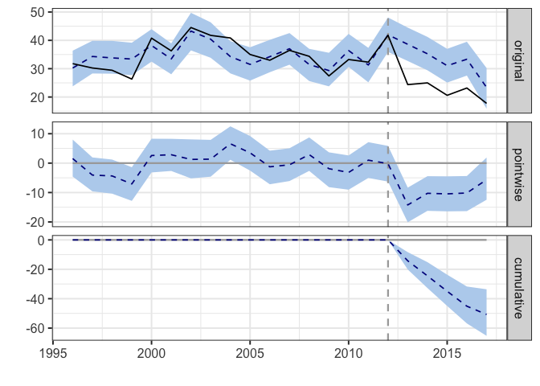
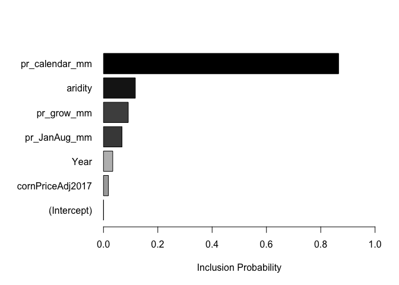
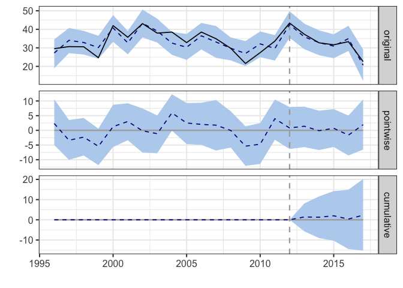
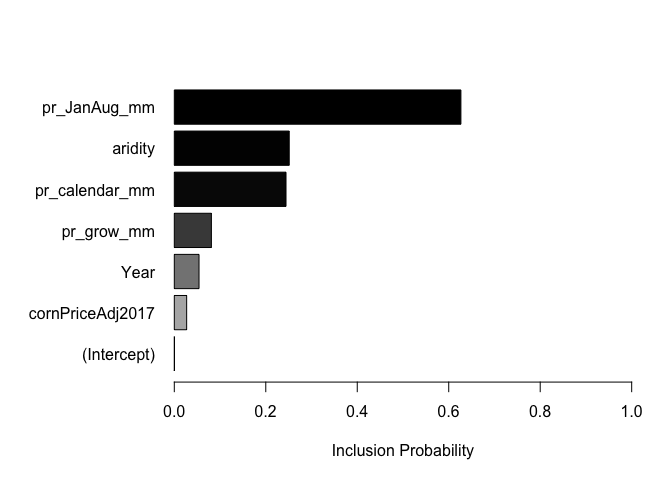
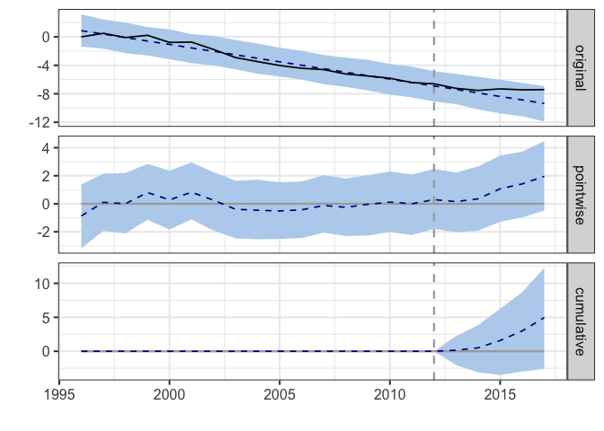
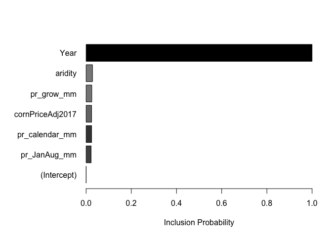
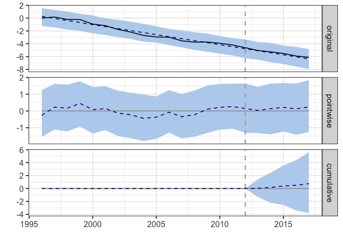

Goal: Analyse the impact of LEMA implementation on well pumping (aggregate) and water table levels.


**R Packages Needed**


```r
library(tidyverse)
library(CausalImpact)
library(knitr)

# filepath to repo on local system
mainDir <- '/Users/deinesji/Documents/code_git/1phd/DeinesEtAl2019_ERL_lema1'
```

# Load Data
master data file created in the aptly named 00.40_makeMasterDataFile.Rmd


```r
dataDir <- paste0(mainDir, '/data/tabular')
masterName <- 'masterTidyData_Wide_20181018.csv'

# load
master0 <- read_csv(paste0(dataDir, '/', masterName)) 
```

```
## Parsed with column specification:
## cols(
##   .default = col_double(),
##   masterid = col_character()
## )
```

```
## See spec(...) for full column specifications.
```

```r
# add a column for presence of LEMA program
lemaKey <- data.frame(Year = 1996:2017,
                      isLema = c(rep('before',17),rep('post',5)))
master <- master0 %>% left_join(lemaKey, by = 'Year')

# make a long version of relevant variables
waterUseLong <- master %>%
  dplyr::select(c(masterid, Year, wimasVol_km3, wimasIrrArea_ha, wtElev_m,
                  wtRelative2012_m,wtRelative0_m, pr_calendar_mm, irrigated_ha,
                  aimIrr_ha, annualChange_m)) %>%
  tidyr::gather(., key = variable, value = value, wimasVol_km3:annualChange_m)

# separate regions
sheridan <- master %>% filter(masterid == 'sheridan')
null9 <- master %>% filter(masterid == 'null_geo9')


set.seed(43)
```

# Functions

## causalImpact helper fun
simplify individual runs slightly. note the intervention time is static and specific to LEMA


```r
runCausalImpact <- function(startYear,endYear, dataframe){
  # make a zoo object for row index thingy
  year <- c(startYear:endYear)
  inputZoo <- zoo(as.matrix(dataframe),  year)

  # run model (intervention year is static)
  before <- c(startYear,2012)
  after <- c(2013,endYear)
  causalModel <- CausalImpact(inputZoo, before, after)
  return(causalModel)
}
```

# Pumping Volumes
Compare aggregate pumping per region by pre-/post-LEMA periods

## Numbers


```r
master2002 <- master %>% filter(Year >= 2002)

cropMasterTable <- master2002 %>%
  dplyr::select(c(masterid, isLema, wimasVol_km3, wtElev_m, wtRelative0_m,
                   pr_JanAug_mm, pr_grow_mm, pr_calendar_mm, cornPriceAdj2017,
                   wimasIrrArea_ha, aimIrr_ha, cropActive_ha, aridity,
                  annualChange_m)) %>%
  group_by(masterid, isLema) %>%
  summarise_all(funs(mean), na.rm=TRUE) %>%
  tidyr::gather(., key = variable, value = hectares, 
                wimasVol_km3:annualChange_m) %>%
  tidyr::spread(., key = isLema, value = hectares) %>%
  ungroup() %>%
  group_by(masterid, variable) %>%
  mutate(percDiff = (post - before)/before*100,
         diff = post - before) %>%
  arrange(variable, masterid)

options(scipen=999)    
kable(cropMasterTable, digits = 2)
```


masterid    variable              before       post   percDiff      diff
----------  -----------------  ---------  ---------  ---------  --------
null_geo9   aimIrr_ha            7393.77    8026.34       8.56    632.57
sheridan    aimIrr_ha            8134.86    8824.88       8.48    690.02
null_geo9   annualChange_m         -0.31      -0.30      -5.14      0.02
sheridan    annualChange_m         -0.53      -0.16     -69.57      0.37
null_geo9   aridity                 0.34       0.42      21.60      0.07
sheridan    aridity                 0.34       0.44      28.43      0.10
null_geo9   cornPriceAdj2017        3.60       4.16      15.76      0.57
sheridan    cornPriceAdj2017        3.60       4.16      15.76      0.57
null_geo9   cropActive_ha       17665.73   18094.23       2.43    428.50
sheridan    cropActive_ha       17654.46   18353.14       3.96    698.68
null_geo9   pr_calendar_mm        494.81     543.43       9.83     48.62
sheridan    pr_calendar_mm        500.65     581.54      16.16     80.90
null_geo9   pr_grow_mm            339.46     403.47      18.85     64.00
sheridan    pr_grow_mm            339.98     430.74      26.70     90.76
null_geo9   pr_JanAug_mm          463.71     525.29      13.28     61.58
sheridan    pr_JanAug_mm          469.28     560.44      19.43     91.16
null_geo9   wimasIrrArea_ha      9072.10    9148.01       0.84     75.90
sheridan    wimasIrrArea_ha     10039.60    9588.71      -4.49   -450.89
null_geo9   wimasVol_km3           34.68      31.53      -9.10     -3.16
sheridan    wimasVol_km3           36.43      22.18     -39.11    -14.25
null_geo9   wtElev_m              885.40     883.13      -0.26     -2.26
sheridan    wtElev_m              827.31     824.54      -0.33     -2.77
null_geo9   wtRelative0_m          -3.31      -5.57      68.51     -2.26
sheridan    wtRelative0_m          -4.61      -7.38      60.02     -2.77


## Causal Impact Analysis
Using the `CausalImpact` package. the first column of the input dataframe needs to be the response variable (here, pumping), and all subsequent columns are taken as covariates

Covariates can't be affected by the intervention

### sheridan pumping
covariates: year, precipitation, aridity, corn prices. 


```r
# extract df for causalimpact
sheridanPumping <- sheridan %>% 
  filter(Year <= 2017) %>%
  dplyr::select(c(wimasVol_km3, Year, pr_calendar_mm, pr_grow_mm, pr_JanAug_mm,
                   aridity, cornPriceAdj2017)) 

# format data input and run model
sheridanModel <- runCausalImpact(1996, 2017, sheridanPumping)

# see results
plot(sheridanModel) 
```

```
## Warning: Removed 22 rows containing missing values (geom_path).
```

```
## Warning: Removed 44 rows containing missing values (geom_path).
```

<!-- -->

```r
summary(sheridanModel)
```

```
## Posterior inference {CausalImpact}
## 
##                          Average        Cumulative  
## Actual                   22             111         
## Prediction (s.d.)        32 (1.6)       162 (7.8)   
## 95% CI                   [29, 35]       [145, 176]  
##                                                     
## Absolute effect (s.d.)   -10 (1.6)      -51 (7.8)   
## 95% CI                   [-13, -6.7]    [-65, -33.6]
##                                                     
## Relative effect (s.d.)   -31% (4.9%)    -31% (4.9%) 
## 95% CI                   [-40%, -21%]   [-40%, -21%]
## 
## Posterior tail-area probability p:   0.001
## Posterior prob. of a causal effect:  99.8999%
## 
## For more details, type: summary(impact, "report")
```

```r
summary(sheridanModel, 'report')
```

```
## Analysis report {CausalImpact}
## 
## 
## During the post-intervention period, the response variable had an average value of approx. 22.18. By contrast, in the absence of an intervention, we would have expected an average response of 32.33. The 95% interval of this counterfactual prediction is [28.90, 35.24]. Subtracting this prediction from the observed response yields an estimate of the causal effect the intervention had on the response variable. This effect is -10.14 with a 95% interval of [-13.05, -6.72]. For a discussion of the significance of this effect, see below.
## 
## Summing up the individual data points during the post-intervention period (which can only sometimes be meaningfully interpreted), the response variable had an overall value of 110.91. By contrast, had the intervention not taken place, we would have expected a sum of 161.63. The 95% interval of this prediction is [144.51, 176.18].
## 
## The above results are given in terms of absolute numbers. In relative terms, the response variable showed a decrease of-31%. The 95% interval of this percentage is [-40%, -21%].
## 
## This means that the negative effect observed during the intervention period is statistically significant. If the experimenter had expected a positive effect, it is recommended to double-check whether anomalies in the control variables may have caused an overly optimistic expectation of what should have happened in the response variable in the absence of the intervention.
## 
## The probability of obtaining this effect by chance is very small (Bayesian one-sided tail-area probability p = 0.001). This means the causal effect can be considered statistically significant.
```

```r
# what variables were important?
plot(sheridanModel$model$bsts.model, "coefficients")
```

<!-- -->

### Null/Control Region pumping
does the intervention have any effect on the null? Using exact same model inputs.


```r
# extract df for causalimpact
nullPumping <- null9 %>% 
  filter(Year <= 2017) %>%
  dplyr::select(c(wimasVol_km3, Year, pr_calendar_mm, pr_grow_mm, pr_JanAug_mm,
                  aridity, cornPriceAdj2017)) 

# format data input and run model
nullModel <- runCausalImpact(1996, 2017, nullPumping)

# see results
plot(nullModel)  
```

```
## Warning: Removed 22 rows containing missing values (geom_path).
```

```
## Warning: Removed 44 rows containing missing values (geom_path).
```

<!-- -->

```r
summary(nullModel)
```

```
## Posterior inference {CausalImpact}
## 
##                          Average        Cumulative  
## Actual                   32             158         
## Prediction (s.d.)        31 (1.9)       155 (9.4)   
## 95% CI                   [27, 35]       [137, 173]  
##                                                     
## Absolute effect (s.d.)   0.46 (1.9)     2.29 (9.4)  
## 95% CI                   [-3, 4]        [-15, 20]   
##                                                     
## Relative effect (s.d.)   1.5% (6%)      1.5% (6%)   
## 95% CI                   [-9.8%, 13%]   [-9.8%, 13%]
## 
## Posterior tail-area probability p:   0.382
## Posterior prob. of a causal effect:  62%
## 
## For more details, type: summary(impact, "report")
```

```r
summary(nullModel, 'report')
```

```
## Analysis report {CausalImpact}
## 
## 
## During the post-intervention period, the response variable had an average value of approx. 31.53. In the absence of an intervention, we would have expected an average response of 31.07. The 95% interval of this counterfactual prediction is [27.49, 34.57]. Subtracting this prediction from the observed response yields an estimate of the causal effect the intervention had on the response variable. This effect is 0.46 with a 95% interval of [-3.05, 4.04]. For a discussion of the significance of this effect, see below.
## 
## Summing up the individual data points during the post-intervention period (which can only sometimes be meaningfully interpreted), the response variable had an overall value of 157.64. Had the intervention not taken place, we would have expected a sum of 155.35. The 95% interval of this prediction is [137.44, 172.87].
## 
## The above results are given in terms of absolute numbers. In relative terms, the response variable showed an increase of +1%. The 95% interval of this percentage is [-10%, +13%].
## 
## This means that, although the intervention appears to have caused a positive effect, this effect is not statistically significant when considering the entire post-intervention period as a whole. Individual days or shorter stretches within the intervention period may of course still have had a significant effect, as indicated whenever the lower limit of the impact time series (lower plot) was above zero. The apparent effect could be the result of random fluctuations that are unrelated to the intervention. This is often the case when the intervention period is very long and includes much of the time when the effect has already worn off. It can also be the case when the intervention period is too short to distinguish the signal from the noise. Finally, failing to find a significant effect can happen when there are not enough control variables or when these variables do not correlate well with the response variable during the learning period.
## 
## The probability of obtaining this effect by chance is p = 0.382. This means the effect may be spurious and would generally not be considered statistically significant.
```

```r
# what variables were important?
plot(nullModel$model$bsts.model, "coefficients")
```

<!-- -->


# Water Levels

## Causal Impact

### Sheridan Water Table


```r
# extract df for causalimpact
sheridanwt <- sheridan %>% 
   dplyr::select(c(wtRelative0_m, Year, pr_calendar_mm, pr_grow_mm,
                  pr_JanAug_mm, 
                  aridity, cornPriceAdj2017)) 

# format data input and run model
sheridanModel_wt <- runCausalImpact(1996, 2017, sheridanwt)

plot(sheridanModel_wt) 
```

```
## Warning: Removed 22 rows containing missing values (geom_path).
```

```
## Warning: Removed 44 rows containing missing values (geom_path).
```

<!-- -->

```r
summary(sheridanModel_wt)
```

```
## Posterior inference {CausalImpact}
## 
##                          Average        Cumulative    
## Actual                   -7.4           -36.9         
## Prediction (s.d.)        -8.4 (0.76)    -41.9 (3.80)  
## 95% CI                   [-9.8, -6.9]   [-49.2, -34.3]
##                                                       
## Absolute effect (s.d.)   0.99 (0.76)    4.96 (3.80)   
## 95% CI                   [-0.52, 2.5]   [-2.59, 12.3] 
##                                                       
## Relative effect (s.d.)   -12% (-9.1%)   -12% (-9.1%)  
## 95% CI                   [6.2%, -29%]   [6.2%, -29%]  
## 
## Posterior tail-area probability p:   0.09879
## Posterior prob. of a causal effect:  90%
## 
## For more details, type: summary(impact, "report")
```

```r
summary(sheridanModel_wt, 'report')
```

```
## Analysis report {CausalImpact}
## 
## 
## During the post-intervention period, the response variable had an average value of approx. -7.38. By contrast, in the absence of an intervention, we would have expected an average response of -8.38. The 95% interval of this counterfactual prediction is [-9.84, -6.87]. Subtracting this prediction from the observed response yields an estimate of the causal effect the intervention had on the response variable. This effect is 0.99 with a 95% interval of [-0.52, 2.45]. For a discussion of the significance of this effect, see below.
## 
## Summing up the individual data points during the post-intervention period (which can only sometimes be meaningfully interpreted), the response variable had an overall value of -36.92. By contrast, had the intervention not taken place, we would have expected a sum of -41.88. The 95% interval of this prediction is [-49.20, -34.33].
## 
## The above results are given in terms of absolute numbers. In relative terms, the response variable showed a decrease of-12%. The 95% interval of this percentage is [+6%, -29%].
## 
## This means that the negative effect observed during the intervention period is statistically significant. If the experimenter had expected a positive effect, it is recommended to double-check whether anomalies in the control variables may have caused an overly optimistic expectation of what should have happened in the response variable in the absence of the intervention.
## 
## The probability of obtaining this effect by chance is p = 0.099. This means the effect may be spurious and would generally not be considered statistically significant.
```

```r
plot(sheridanModel_wt$model$bsts.model, "coefficients")
```

<!-- -->

#### Summary of rate of change
Reviewer Question: did the rate of decline change?


```r
# get annual changes
sheridanwt_lag <- sheridanwt %>%
  mutate(wtlag = wtRelative0_m - lag(wtRelative0_m))

# summarize for pre-lema ref period
sheridanwt_lag %>%
  filter(Year <= 2012 & Year > 2002) %>%
  summarize(mean(wtlag))
```

```
## # A tibble: 1 x 1
##   `mean(wtlag)`
##           <dbl>
## 1        -0.483
```

```r
# don't include 2013 since that is the change from 2012 = 2012 pre-lema pumping
sheridanwt_lag %>%
  filter(Year <= 2017 & Year > 2013) %>%
  summarize(mean(wtlag))
```

```
## # A tibble: 1 x 1
##   `mean(wtlag)`
##           <dbl>
## 1       -0.0439
```


### Null Water Table


```r
# extract df for causalimpact
nullwt <- null9 %>% 
  dplyr::select(c(wtRelative0_m,Year,  pr_calendar_mm, pr_grow_mm,
                  pr_JanAug_mm, 
                  aridity, cornPriceAdj2017))

# format data input and run model
nullModel_wt <- runCausalImpact(1996, 2017, nullwt)


plot(nullModel_wt) 
```

```
## Warning: Removed 22 rows containing missing values (geom_path).
```

```
## Warning: Removed 44 rows containing missing values (geom_path).
```

<!-- -->

```r
summary(nullModel_wt)
```

```
## Posterior inference {CausalImpact}
## 
##                          Average         Cumulative    
## Actual                   -5.6            -27.9         
## Prediction (s.d.)        -5.7 (0.5)      -28.6 (2.5)   
## 95% CI                   [-6.7, -4.8]    [-33.5, -24.0]
##                                                        
## Absolute effect (s.d.)   0.15 (0.5)      0.75 (2.5)    
## 95% CI                   [-0.76, 1.1]    [-3.82, 5.6]  
##                                                        
## Relative effect (s.d.)   -2.6% (-8.7%)   -2.6% (-8.7%) 
## 95% CI                   [13%, -20%]     [13%, -20%]   
## 
## Posterior tail-area probability p:   0.37702
## Posterior prob. of a causal effect:  62%
## 
## For more details, type: summary(impact, "report")
```

```r
summary(nullModel_wt, 'report')
```

```
## Analysis report {CausalImpact}
## 
## 
## During the post-intervention period, the response variable had an average value of approx. -5.57. By contrast, in the absence of an intervention, we would have expected an average response of -5.72. The 95% interval of this counterfactual prediction is [-6.69, -4.81]. Subtracting this prediction from the observed response yields an estimate of the causal effect the intervention had on the response variable. This effect is 0.15 with a 95% interval of [-0.76, 1.12]. For a discussion of the significance of this effect, see below.
## 
## Summing up the individual data points during the post-intervention period (which can only sometimes be meaningfully interpreted), the response variable had an overall value of -27.85. By contrast, had the intervention not taken place, we would have expected a sum of -28.60. The 95% interval of this prediction is [-33.46, -24.04].
## 
## The above results are given in terms of absolute numbers. In relative terms, the response variable showed a decrease of-3%. The 95% interval of this percentage is [+13%, -20%].
## 
## This means that the negative effect observed during the intervention period is statistically significant. If the experimenter had expected a positive effect, it is recommended to double-check whether anomalies in the control variables may have caused an overly optimistic expectation of what should have happened in the response variable in the absence of the intervention.
## 
## The probability of obtaining this effect by chance is p = 0.377. This means the effect may be spurious and would generally not be considered statistically significant.
```

#### Summary of rate of change
Reviewer Question: did the rate of decline change?


```r
# get annual changes
nullwt_lag <- nullwt %>%
  mutate(wtlag = wtRelative0_m - lag(wtRelative0_m))

# summarize for pre-lema ref period
nullwt_lag %>%
  filter(Year <= 2012 & Year > 2002) %>%
  summarize(mean(wtlag))
```

```
## # A tibble: 1 x 1
##   `mean(wtlag)`
##           <dbl>
## 1        -0.286
```

```r
# don't include 2013 since that ist he change from 2012 = 2012 pre-lema pumping
nullwt_lag %>%
  filter(Year <= 2017 & Year > 2013) %>%
  summarize(mean(wtlag))
```

```
## # A tibble: 1 x 1
##   `mean(wtlag)`
##           <dbl>
## 1        -0.263
```

# Combine Model Output

## Extract tables

### function to pull data


```r
extractModelNums <- function(causalModel1, variable1, masterid1, startYear){
  data1 <- as.data.frame(causalModel1$series[,c('response','point.pred',
                                 'point.pred.lower', 'point.pred.upper')])
  data1$variable <- variable1
  data1$masterid <- masterid1
  data1$year <- startYear:(startYear+nrow(data1)-1)
  return(data1)
}
```

### extract and merge


```r
# get model output
sherPump <- extractModelNums(sheridanModel, 'pumping','LEMA', 1996)
nullPump <- extractModelNums(nullModel, 'pumping','Control', 1996)
sherWT <- extractModelNums(sheridanModel_wt, 'wtElev','LEMA', 1996)
nullWT <- extractModelNums(nullModel_wt, 'wtElev','Control', 1996)

# combine and export
allModels <- rbind(sherPump,nullPump, sherWT, nullWT)

write_csv(allModels, paste0(dataDir,'/causalImpact_summaries_05-20_20181018.csv'))
```


