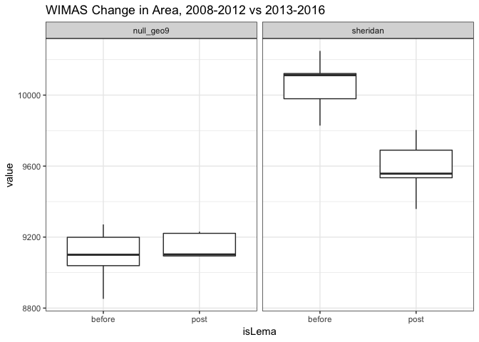
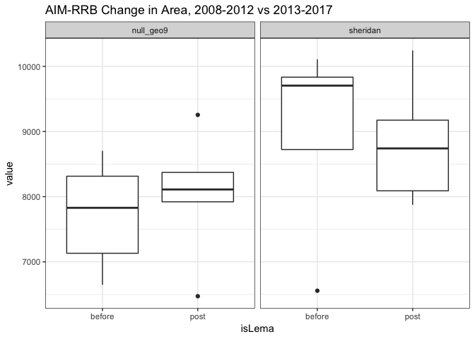
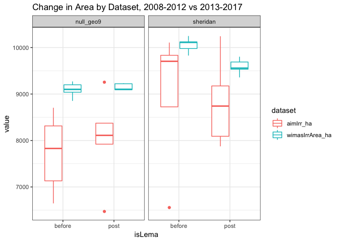

Goal: Summarize changes in irrigated area and crop choices before/after LEMA


**R Packages Needed**


```r
library(tidyverse)
library(broom)
library(lubridate)
library(knitr)

# filepath to repo on local system
mainDir <- '/Users/deinesji/Documents/code_git/1phd/DeinesEtAl2019_ERL_lema1'
```

# Load Data
master data file created in the aptly named 00.40_makeMasterDataFile.Rmd


```r
dataDir <- paste0(mainDir, '/data/tabular')
masterName <- 'masterTidyData_Wide_20181018.csv'

# load
master0 <- read_csv(paste0(dataDir, '/', masterName)) 
```

```
## Parsed with column specification:
## cols(
##   .default = col_double(),
##   masterid = col_character()
## )
```

```
## See spec(...) for full column specifications.
```

```r
# add a column for presence of LEMA program
lemaKey <- data.frame(Year = 1996:2017,
                      isLema = c(rep('before',17),rep('post',5)))
master <- master0 %>%
  left_join(lemaKey, by = 'Year')


# subset for 5 year before/after
master5 <- master %>% filter(Year > 2007)
sheridan5 <- master5 %>% filter(masterid == 'sheridan') %>% arrange(Year)
control5 <- master5 %>% filter(masterid == 'null_geo9') %>% arrange(Year)
```

# Crops

## Master Table
Display before, after, and % change for pre and post means


```r
cropMasterTable <- master5 %>%
  dplyr::select(-c(wimasVol_km3, wtElev_m, wtRelative0_m, wtRelative2012_m,
                   pr_JanAug_mm, pr_grow_mm,
                   totalArea_ha, nonAg_ha, Year, Alfalfa_irrigated_ha,
                   Alfalfa_rainfed_ha, annualChange_m)) %>%
  group_by(masterid, isLema) %>%
  summarise_all(funs(mean), na.rm=TRUE) %>%
  tidyr::gather(., key = variable, value = hectares, 
                wimasIrrArea_ha:cornPriceAdj2017) %>%
  tidyr::spread(., key = isLema, value = hectares) %>%
  ungroup() %>%
  group_by(masterid, variable) %>%
  mutate(percDiff = (post - before)/before*100,
         diff = post - before) %>%
  arrange(variable, masterid)

options(scipen=999)    
kable(cropMasterTable, digits = 2)
```


masterid    variable                      before       post   percDiff      diff
----------  -------------------------  ---------  ---------  ---------  --------
null_geo9   aimIrr_ha                    7725.15    8026.34       3.90    301.19
sheridan    aimIrr_ha                    8985.46    8824.88      -1.79   -160.58
null_geo9   aridity                         0.38       0.42      10.24      0.04
sheridan    aridity                         0.37       0.44      17.83      0.07
null_geo9   Corn_irrigated_ha            6505.44    6490.09      -0.24    -15.35
sheridan    Corn_irrigated_ha            6892.35    6004.94     -12.88   -887.41
null_geo9   Corn_rainfed_ha              5596.13    5491.36      -1.87   -104.77
sheridan    Corn_rainfed_ha              5535.68    4886.54     -11.73   -649.14
null_geo9   cornPriceAdj2017                5.01       4.16     -16.93     -0.85
sheridan    cornPriceAdj2017                5.01       4.16     -16.93     -0.85
null_geo9   cropActive_ha               18072.50   18094.23       0.12     21.73
sheridan    cropActive_ha               18340.98   18353.14       0.07     12.16
null_geo9   doubleCropped_ha               30.64      78.23     155.32     47.59
sheridan    doubleCropped_ha               18.04      42.56     135.93     24.52
null_geo9   fallow_ha                    2627.87    2715.14       3.32     87.28
sheridan    fallow_ha                    2282.02    2468.04       8.15    186.02
null_geo9   irrigated_ha                 7671.05    7928.12       3.35    257.07
sheridan    irrigated_ha                 8918.33    8733.95      -2.07   -184.38
null_geo9   pr_calendar_mm                535.79     543.43       1.43      7.64
sheridan    pr_calendar_mm                538.93     581.54       7.91     42.61
null_geo9   rainfed_ha                  10401.45   10166.11      -2.26   -235.34
sheridan    rainfed_ha                   9422.65    9619.19       2.09    196.54
null_geo9   Sorghum_irrigated_ha          130.15     261.51     100.94    131.36
sheridan    Sorghum_irrigated_ha          162.17     961.92     493.15    799.75
null_geo9   Sorghum_rainfed_ha            833.99     981.86      17.73    147.87
sheridan    Sorghum_rainfed_ha            758.71    1447.72      90.81    689.01
null_geo9   Soybeans_irrigated_ha         661.40     627.06      -5.19    -34.34
sheridan    Soybeans_irrigated_ha        1475.69     965.99     -34.54   -509.70
null_geo9   Soybeans_rainfed_ha           134.44      64.49     -52.03    -69.95
sheridan    Soybeans_rainfed_ha           208.50      50.19     -75.93   -158.32
null_geo9   wimasIrrArea_ha              9092.40    9148.01       0.61     55.60
sheridan    wimasIrrArea_ha             10058.15    9588.71      -4.67   -469.44
null_geo9   WinterWheat_irrigated_ha      229.95     418.95      82.19    189.00
sheridan    WinterWheat_irrigated_ha      186.43     603.23     223.58    416.81
null_geo9   WinterWheat_rainfed_ha       3722.69    3526.08      -5.28   -196.61
sheridan    WinterWheat_rainfed_ha       2837.48    3110.30       9.61    272.82

Calculate corn's percentage of irrigated area pre/post LEMA in Sheridan


```r
cropMasterTable %>%
  ungroup() %>%
  filter(masterid == 'sheridan' & variable %in% 
           c('aimIrr_ha', 'Corn_irrigated_ha', 'wimasIrrArea_ha'))
```

```
## # A tibble: 3 x 6
##   masterid variable          before  post percDiff  diff
##   <chr>    <chr>              <dbl> <dbl>    <dbl> <dbl>
## 1 sheridan aimIrr_ha          8985. 8825.    -1.79 -161.
## 2 sheridan Corn_irrigated_ha  6892. 6005.   -12.9  -887.
## 3 sheridan wimasIrrArea_ha   10058. 9589.    -4.67 -469.
```

```r
# irr area mean pre-lema
irrPre <- mean(8985,10058)
irrPost <- mean(8825,9589)

# corn proportion preLema
6892/irrPre
```

```
## [1] 0.7670562
```

```r
# corn proportion postLema
6005/irrPost
```

```
## [1] 0.6804533
```


# Irrigated Area

Examine changes in irrigated area. Compare estimates from WIMAS and AIM-RRB.

## 5 years before (2008-2017)

Summarize WIMAS


```r
# summary
master5 %>%
  group_by(masterid, isLema)  %>%
  summarize(Mean = mean(wimasIrrArea_ha, na.rm=TRUE),
            q25 = quantile(wimasIrrArea_ha, .25, na.rm=TRUE),
            q50 = quantile(wimasIrrArea_ha, .5, na.rm=TRUE),
            q75 = quantile(wimasIrrArea_ha, .75, na.rm=TRUE),
            min = min(wimasIrrArea_ha, na.rm=TRUE),
            max = max(wimasIrrArea_ha, na.rm=TRUE))
```

```
## # A tibble: 4 x 8
## # Groups:   masterid [?]
##   masterid  isLema   Mean   q25    q50    q75   min    max
##   <chr>     <fct>   <dbl> <dbl>  <dbl>  <dbl> <dbl>  <dbl>
## 1 null_geo9 before  9092. 9039.  9101.  9199. 8852.  9271.
## 2 null_geo9 post    9148. 9094.  9102.  9221. 9092.  9230.
## 3 sheridan  before 10058. 9980. 10112. 10122. 9828. 10249.
## 4 sheridan  post    9589. 9534.  9557.  9690. 9358.  9804.
```

```r
# rough stats
wimIrr <- master5 %>%
  filter(Year <= 2017) %>%
  group_by(masterid)  %>%
  do(tidy(t.test(wimasIrrArea_ha~isLema, data =.)))
wimIrr
```

```
## # A tibble: 2 x 11
## # Groups:   masterid [2]
##   masterid estimate estimate1 estimate2 statistic p.value parameter
##   <chr>       <dbl>     <dbl>     <dbl>     <dbl>   <dbl>     <dbl>
## 1 null_ge…    -55.6     9092.     9148.    -0.705 0.509        5.50
## 2 sheridan    469.     10058.     9589.     4.52  0.00196      7.98
## # ... with 4 more variables: conf.low <dbl>, conf.high <dbl>,
## #   method <chr>, alternative <chr>
```

Summarise AIM


```r
master5 %>%
   group_by(masterid, isLema)  %>%
  summarize(Mean = mean(aimIrr_ha, na.rm=TRUE),
            q25 = quantile(aimIrr_ha, .25, na.rm=TRUE),
            q50 = quantile(aimIrr_ha, .5, na.rm=TRUE),
            q75 = quantile(aimIrr_ha, .75, na.rm=TRUE),
            min = min(aimIrr_ha, na.rm=TRUE),
            max = max(aimIrr_ha, na.rm=TRUE))
```

```
## # A tibble: 4 x 8
## # Groups:   masterid [?]
##   masterid  isLema  Mean   q25   q50   q75   min    max
##   <chr>     <fct>  <dbl> <dbl> <dbl> <dbl> <dbl>  <dbl>
## 1 null_geo9 before 7725. 7131. 7829. 8314. 6647.  8705.
## 2 null_geo9 post   8026. 7921. 8111. 8372. 6472.  9255.
## 3 sheridan  before 8985. 8724. 9705. 9834. 6556. 10108.
## 4 sheridan  post   8825. 8091. 8741. 9174. 7874. 10244.
```

```r
# rough stats
wimIrr <- master %>%
  filter(Year %in% 2008:2017) %>%
  group_by(masterid)  %>%
  do(tidy(t.test(aimIrr_ha~isLema, data =.)))
wimIrr
```

```
## # A tibble: 2 x 11
## # Groups:   masterid [2]
##   masterid estimate estimate1 estimate2 statistic p.value parameter
##   <chr>       <dbl>     <dbl>     <dbl>     <dbl>   <dbl>     <dbl>
## 1 null_ge…    -301.     7725.     8026.    -0.513   0.622      7.75
## 2 sheridan     161.     8985.     8825.     0.207   0.842      6.87
## # ... with 4 more variables: conf.low <dbl>, conf.high <dbl>,
## #   method <chr>, alternative <chr>
```


plot them


```r
# get mean irrigated area, before and after
meanIrrArea <- master %>%
  filter(Year > 2007) %>%
  dplyr::select(masterid, isLema, wimasIrrArea_ha, aimIrr_ha) %>%
  gather(., key = dataset, value = value, wimasIrrArea_ha:aimIrr_ha)

# plot wimas
ggplot(meanIrrArea %>% filter(dataset == 'wimasIrrArea_ha'), 
       aes(x = isLema, y = value)) +
  geom_boxplot() + 
  facet_wrap(~masterid) +
  theme_bw() + 
  ggtitle('WIMAS Change in Area, 2008-2012 vs 2013-2016')
```

<!-- -->

```r
# plot aim
ggplot(meanIrrArea %>% filter(dataset == 'aimIrr_ha'), 
       aes(x = isLema, y = value)) +
  geom_boxplot() + 
  facet_wrap(~masterid) +
  theme_bw() + 
  ggtitle('AIM-RRB Change in Area, 2008-2012 vs 2013-2017')
```

<!-- -->

```r
# plot both
ggplot(meanIrrArea, 
       aes(x = isLema, y = value, group = interaction(dataset, isLema), color = dataset)) +
  geom_boxplot() + 
  facet_wrap(~masterid) +
  theme_bw() + 
  ggtitle('Change in Area by Dataset, 2008-2012 vs 2013-2017')
```

<!-- -->


