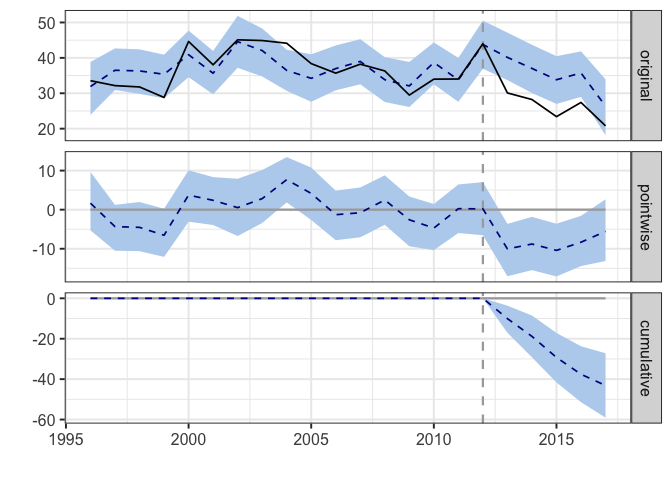
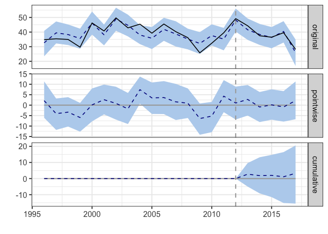
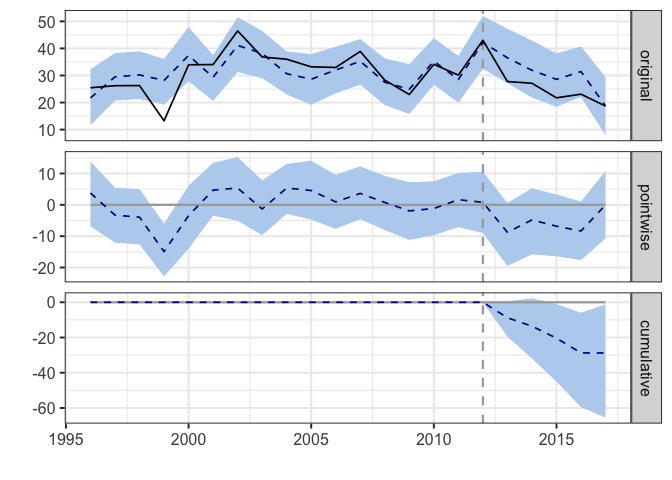
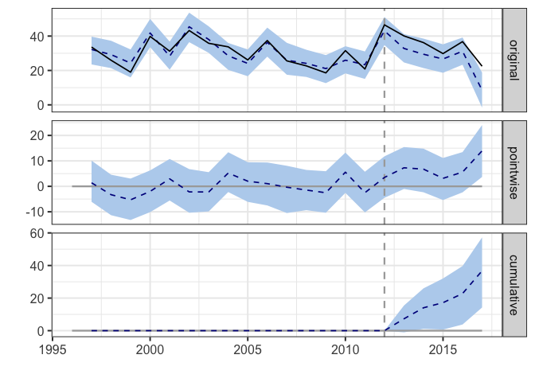
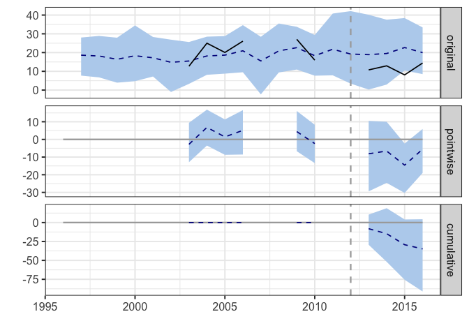
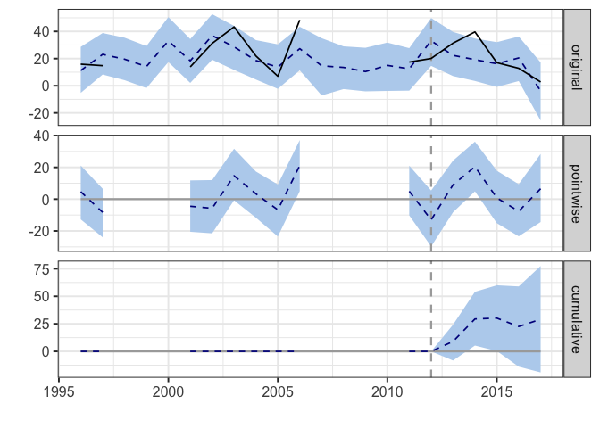
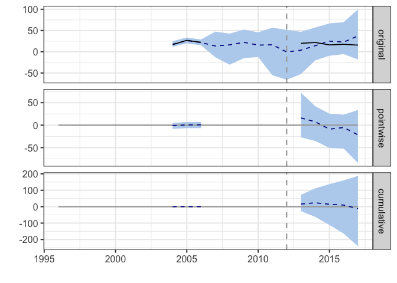
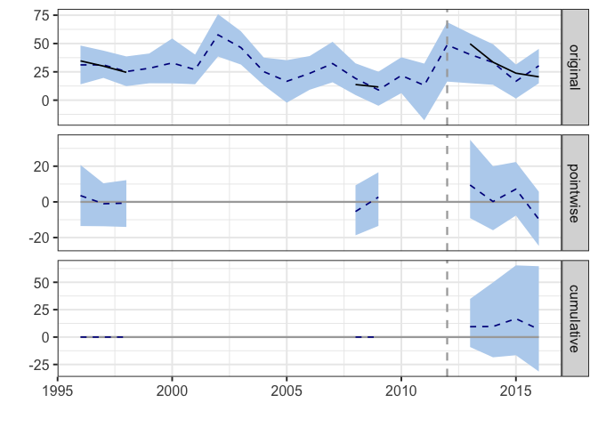

Goal: Check out changes in irrigation water applied by crop via causalImpact analysis (to control for annual climate)


**R Packages Needed**


```r
library(tidyverse)
library(CausalImpact)

# filepath to repo on local system
mainDir <- '/Users/deinesji/Documents/code_git/1phd/DeinesEtAl2019_ERL_lema1'
```

# Load
uses formatted wimas data from 00.35_wells_WIMAS.Rmd (PDIV_ID well id column removed to preserve anonymity) and gets precip from master data file from 00.40_makeMasterDataFile.Rmd


```r
# wimas ---------------------------------------------------
wellDir <- paste0(mainDir, '/data/wellData/WIMAS_AnthonyCleaned_JillFormatted')

# load cleaned well data 
wells<- read_csv(paste0(wellDir,
                  '/WIMAS_1996-2017_SheridanNull9_convertedUnits_noPDIV_ID.csv'))
```

```
## Parsed with column specification:
## cols(
##   masterid = col_character(),
##   year = col_integer(),
##   crop = col_integer(),
##   volume_m3 = col_double(),
##   area_m2 = col_double(),
##   depth_m = col_double(),
##   system = col_integer()
## )
```

```r
# add a column for presence of LEMA program
lemaKey <- data.frame(year = 1996:2017,
                      isLema = c(rep('before',17),rep('post',5)))
wellsPeriod <- wells %>%
  left_join(lemaKey, by = 'year')

# remove NA's
wellsComplete <- wellsPeriod[!is.na(wellsPeriod$volume_m3),]

# climate covariables ------------------------------------------
dataDir <- paste0(mainDir, '/data/tabular')
masterName <- 'masterTidyData_Wide_20181018.csv'

# load
master <- read_csv(paste0(dataDir, '/', masterName)) %>%
  dplyr::select(c(masterid,Year,pr_calendar_mm, pr_JanAug_mm, 
                  pr_grow_mm, aridity, cornPriceAdj2017)) 
```

```
## Parsed with column specification:
## cols(
##   .default = col_double(),
##   masterid = col_character()
## )
```

```
## See spec(...) for full column specifications.
```

# Functions

## causalImpact helper fun
simplify individual runs slightly. note the intervention time is static and specific to LEMA


```r
runCausalImpact <- function(startYear,endYear, dataframe){
  set.seed(5)
  # make a zoo object for row index thingy
  year <- c(startYear:endYear)
  inputZoo <- zoo(as.matrix(dataframe),  year)

  # run model (intervention year is static)
  before <- c(startYear,2012)
  after <- c(2013,endYear)
  causalModel <- CausalImpact(inputZoo, before, after)
  return(causalModel)
}
```


# Corn

## Get Mean Depth
Calculate average irrigation depth for corn fields based on WIMAS data.
In WIMAS, fields that are 100% corn are '2'

Other codes of interest:

* 3 = grain sorghum
* 4 = soybeans
* 5 = wheat


## Prepare for CausalImpact
add climate variables and split into regions


```r
# mean depth by region
cornDepth <- wellsComplete %>%
  filter(crop == '2' & depth_m >0) %>%
  group_by(masterid, year) %>%
  summarise(meanDepth_cm = mean(depth_m*100))

startYear <- 1996
endYear <- 2017
cornVars <- cornDepth %>%
  filter(year > startYear-1) %>%
  rename(Year = year) %>%
  left_join(master, by = c('masterid','Year'))

sheridanCorn <- cornVars %>% 
  ungroup() %>%
  filter(masterid == 'sheridan') %>%
  dplyr::select(-c(masterid, Year))  %>%
  mutate(year = startYear:endYear)
controlCorn <- cornVars %>% 
  ungroup() %>%
  filter(masterid == 'null_geo9') %>%
  dplyr::select(-c(masterid, Year)) 
```

## Causal: Sheridan
Question: Did LEMA intervention affect LEMA corn depth?


```r
# format data input and run model
LemaCornModel <- runCausalImpact(startYear, endYear, sheridanCorn)

# see results
plot(LemaCornModel)  
```

```
## Warning: Removed 22 rows containing missing values (geom_path).
```

```
## Warning: Removed 44 rows containing missing values (geom_path).
```

<!-- -->

```r
summary(LemaCornModel)
```

```
## Posterior inference {CausalImpact}
## 
##                          Average        Cumulative  
## Actual                   26             130         
## Prediction (s.d.)        35 (1.7)       173 (8.5)   
## 95% CI                   [31, 38]       [157, 189]  
##                                                     
## Absolute effect (s.d.)   -8.6 (1.7)     -43.1 (8.5) 
## 95% CI                   [-12, -5.4]    [-59, -27.2]
##                                                     
## Relative effect (s.d.)   -25% (4.9%)    -25% (4.9%) 
## 95% CI                   [-34%, -16%]   [-34%, -16%]
## 
## Posterior tail-area probability p:   0.001
## Posterior prob. of a causal effect:  99.9%
## 
## For more details, type: summary(impact, "report")
```

```r
#summary(LemaCornModel, 'report')

# what variables were important?
#plot(LemaCornModel$model$bsts.model, "coefficients")
```

## Causal: Control
Question: Did LEMA intervention affect control corn depth?


```r
# format data input and run model
controlCornModel <- runCausalImpact(1996, 2017, controlCorn)

# see results
plot(controlCornModel)  
```

```
## Warning: Removed 22 rows containing missing values (geom_path).
```

```
## Warning: Removed 44 rows containing missing values (geom_path).
```

<!-- -->

```r
summary(controlCornModel)
```

```
## Posterior inference {CausalImpact}
## 
##                          Average        Cumulative   
## Actual                   37             186          
## Prediction (s.d.)        37 (1.9)       183 (9.3)    
## 95% CI                   [33, 40]       [165, 202]   
##                                                      
## Absolute effect (s.d.)   0.66 (1.9)     3.28 (9.3)   
## 95% CI                   [-3.1, 4.1]    [-15.5, 20.6]
##                                                      
## Relative effect (s.d.)   1.8% (5.1%)    1.8% (5.1%)  
## 95% CI                   [-8.5%, 11%]   [-8.5%, 11%] 
## 
## Posterior tail-area probability p:   0.36217
## Posterior prob. of a causal effect:  64%
## 
## For more details, type: summary(impact, "report")
```

```r
#summary(controlCornModel, 'report')

# what variables were important?
#plot(controlCornModel$model$bsts.model, "coefficients")
```

# Soybeans

## Get Mean Depth


```r
# mean depth by region
soydepth <- wellsComplete %>%
  filter(crop == '4' & depth_m >0) %>%
  group_by(masterid, year) %>%
  summarise(meanDepth_cm = mean(depth_m*100))

startYear <- 1996
endYear <- 2017
soyVars <- soydepth %>%
  filter(year > startYear-1) %>%
  rename(Year = year) %>%
  right_join(master, by = c('masterid','Year'))

sheridanSoy <- soyVars %>% 
  ungroup() %>%
  filter(masterid == 'sheridan' &
           Year <= endYear) %>%
  dplyr::select(-c(masterid, Year))  %>%
  mutate(year = startYear:endYear)
controlSoy <- soyVars %>% 
  ungroup() %>%
  filter(masterid == 'null_geo9' &
           Year <= endYear) %>%
  dplyr::select(-c(masterid, Year))  %>%
  mutate(year = startYear:endYear)
```

## Causal soy
Question: Did LEMA intervention affect LEMA soy depth?


```r
# format data input and run model
LemaSoyModel <- runCausalImpact(startYear, endYear, sheridanSoy)

# see results
plot(LemaSoyModel)  
```

```
## Warning: Removed 22 rows containing missing values (geom_path).
```

```
## Warning: Removed 44 rows containing missing values (geom_path).
```

<!-- -->

```r
summary(LemaSoyModel)
```

```
## Posterior inference {CausalImpact}
## 
##                          Average          Cumulative    
## Actual                   24               118           
## Prediction (s.d.)        29 (3.2)         147 (15.9)    
## 95% CI                   [24, 37]         [120, 184]    
##                                                         
## Absolute effect (s.d.)   -5.8 (3.2)       -28.8 (15.9)  
## 95% CI                   [-13, -0.25]     [-65, -1.27]  
##                                                         
## Relative effect (s.d.)   -20% (11%)       -20% (11%)    
## 95% CI                   [-44%, -0.87%]   [-44%, -0.87%]
## 
## Posterior tail-area probability p:   0.016
## Posterior prob. of a causal effect:  98.4%
## 
## For more details, type: summary(impact, "report")
```

```r
#summary(LemaSoyModel, 'report')

# what variables were important?
#plot(LemaSoyModel$model$bsts.model, "coefficients")
```

## Causal: Control
Question: Did LEMA intervention affect control soy depth?


```r
# format data input and run model
controlSoyModel <- runCausalImpact(startYear, endYear, controlSoy)

# see results
plot(controlSoyModel)  
```

```
## Warning: Removed 22 rows containing missing values (geom_path).
```

```
## Warning: Removed 1 rows containing missing values (geom_path).
```

```
## Warning: Removed 45 rows containing missing values (geom_path).
```

<!-- -->

```r
summary(controlSoyModel)
```

```
## Posterior inference {CausalImpact}
## 
##                          Average      Cumulative 
## Actual                   33           165        
## Prediction (s.d.)        26 (2.3)     129 (11.4) 
## 95% CI                   [22, 30]     [108, 151] 
##                                                  
## Absolute effect (s.d.)   7.3 (2.3)    36.7 (11.4)
## 95% CI                   [2.8, 11]    [14.2, 57] 
##                                                  
## Relative effect (s.d.)   29% (8.8%)   29% (8.8%) 
## 95% CI                   [11%, 45%]   [11%, 45%] 
## 
## Posterior tail-area probability p:   0.005
## Posterior prob. of a causal effect:  99.5%
## 
## For more details, type: summary(impact, "report")
```

```r
#summary(controlSoyModel, 'report')

# what variables were important?
#plot(controlCornModel$model$bsts.model, "coefficients")
```


# Wheat

## Get Mean Depth


```r
# mean depth by region
wheatdepth <- wellsComplete %>%
  filter(crop == '5' & depth_m >0) %>%
  group_by(masterid, year) %>%
  summarise(meanDepth_cm = mean(depth_m*100))

startYear <- 1996
endYear <- 2017
wheatVars <- wheatdepth %>%
  filter(year > startYear-1) %>%
  rename(Year = year) %>%
  right_join(master, by = c('masterid','Year'))

sheridanWheat <- wheatVars %>% 
  ungroup() %>%
  filter(masterid == 'sheridan' &
           Year <= endYear) %>%
  dplyr::select(-c(masterid, Year)) %>%
  mutate(year = startYear:endYear)
controlWheat <- wheatVars %>% 
  ungroup() %>%
  filter(masterid == 'null_geo9' &
                      Year <= endYear) %>%
  dplyr::select(-c(masterid, Year)) %>%
  mutate(year = startYear:endYear)
```

## Causal Wheat
Question: Did LEMA intervention affect LEMA wheat depth?


```r
# format data input and run model
LemaWheatModel <- runCausalImpact(startYear, 2016, sheridanWheat)

# see results
plot(LemaWheatModel)  
```

```
## Warning: Removed 21 rows containing missing values (geom_path).
```

```
## Warning: Removed 1 rows containing missing values (geom_path).
```

```
## Warning: Removed 43 rows containing missing values (geom_path).
```

<!-- -->

```r
summary(LemaWheatModel)
```

```
## Posterior inference {CausalImpact}
## 
##                          Average         Cumulative   
## Actual                   12              46           
## Prediction (s.d.)        20 (5.8)        81 (23.1)    
## 95% CI                   [10, 34]        [42, 137]    
##                                                       
## Absolute effect (s.d.)   -8.7 (5.8)      -34.8 (23.1) 
## 95% CI                   [-23, 1.1]      [-91, 4.4]   
##                                                       
## Relative effect (s.d.)   -43% (28%)      -43% (28%)   
## 95% CI                   [-112%, 5.4%]   [-112%, 5.4%]
## 
## Posterior tail-area probability p:   0.0364
## Posterior prob. of a causal effect:  96.36%
## 
## For more details, type: summary(impact, "report")
```

```r
#summary(LemaWheatModel, 'report')

# what variables were important?
#plot(LemaWheatModel$model$bsts.model, "coefficients")
```

## Causal: Control
Question: Did LEMA intervention affect control wheat depth?


```r
# format data input and run model
controlWheatModel <- runCausalImpact(startYear, endYear, controlWheat)

# see results
plot(controlWheatModel)  
```

```
## Warning: Removed 22 rows containing missing values (geom_path).
```

```
## Warning: Removed 44 rows containing missing values (geom_path).
```

<!-- -->

```r
summary(controlWheatModel)
```

```
## Posterior inference {CausalImpact}
## 
##                          Average        Cumulative  
## Actual                   21             104         
## Prediction (s.d.)        15 (4.7)       75 (23.4)   
## 95% CI                   [5.2, 25]      [26.2, 123] 
##                                                     
## Absolute effect (s.d.)   5.8 (4.7)      29.1 (23.4) 
## 95% CI                   [-3.8, 15]     [-19.1, 77] 
##                                                     
## Relative effect (s.d.)   39% (31%)      39% (31%)   
## 95% CI                   [-26%, 104%]   [-26%, 104%]
## 
## Posterior tail-area probability p:   0.103
## Posterior prob. of a causal effect:  90%
## 
## For more details, type: summary(impact, "report")
```

```r
#summary(controlWheatModel, 'report')

# what variables were important?
#plot(controlWheatModel$model$bsts.model, "coefficients")
```

# Sorghum
See what this looks like with minimal pre-lema data

## Get Mean Depth


```r
# mean depth by region
sorghumdepth <- wellsComplete %>%
  filter(crop == '3' & depth_m >0) %>%
  group_by(masterid, year) %>%
  summarise(meanDepth_cm = mean(depth_m*100))

startYear <- 1996
endYear <- 2017
sorghumVars <- sorghumdepth %>%
  filter(year > startYear-1) %>%
  rename(Year = year) %>%
  right_join(master, by = c('masterid','Year'))

sheridanSorghum <- sorghumVars %>% 
  ungroup() %>%
  filter(masterid == 'sheridan' &
           Year <= endYear) %>%
  dplyr::select(-c(masterid, Year)) %>%
  mutate(year = startYear:endYear)
controlSorghum <- sorghumVars %>% 
  ungroup() %>%
  filter(masterid == 'null_geo9' &
                      Year <= endYear) %>%
  dplyr::select(-c(masterid, Year)) %>%
  mutate(year = startYear:endYear)
```

## Causal Sorghum
Question: Did LEMA intervention affect LEMA wheat depth?


```r
# format data input and run model
LemaSorghumModel <- runCausalImpact(startYear, endYear, sheridanSorghum)

# see results
plot(LemaSorghumModel)  
```

```
## Warning: Removed 22 rows containing missing values (geom_path).
```

```
## Warning: Removed 8 rows containing missing values (geom_path).
```

```
## Warning: Removed 52 rows containing missing values (geom_path).
```

<!-- -->

```r
summary(LemaSorghumModel)
```

```
## Posterior inference {CausalImpact}
## 
##                          Average         Cumulative   
## Actual                   18              91           
## Prediction (s.d.)        21 (18)         103 (90)     
## 95% CI                   [-19, 66]       [-97, 332]   
##                                                       
## Absolute effect (s.d.)   -2.4 (18)       -12.0 (90)   
## 95% CI                   [-48, 38]       [-241, 188]  
##                                                       
## Relative effect (s.d.)   -12% (88%)      -12% (88%)   
## 95% CI                   [-234%, 182%]   [-234%, 182%]
## 
## Posterior tail-area probability p:   0.35751
## Posterior prob. of a causal effect:  64%
## 
## For more details, type: summary(impact, "report")
```

```r
#summary(LemaSorghumModel, 'report')

# what variables were important?
#plot(LemaSorghumModel$model$bsts.model, "coefficients")
```

## Causal: Control
Question: Did LEMA intervention affect control sorghum depth?


```r
# format data input and run model
controlSorghumModel <- runCausalImpact(startYear, 2016, controlSorghum)

# see results
plot(controlSorghumModel)  
```

```
## Warning: Removed 21 rows containing missing values (geom_path).
```

```
## Warning: Removed 42 rows containing missing values (geom_path).
```

<!-- -->

```r
summary(controlSorghumModel)
```

```
## Posterior inference {CausalImpact}
## 
##                          Average       Cumulative 
## Actual                   32            128        
## Prediction (s.d.)        30 (5.8)      121 (23.1) 
## 95% CI                   [16, 40]      [63, 159]  
##                                                   
## Absolute effect (s.d.)   1.8 (5.8)     7.0 (23.1) 
## 95% CI                   [-7.9, 16]    [-31.4, 65]
##                                                   
## Relative effect (s.d.)   5.8% (19%)    5.8% (19%) 
## 95% CI                   [-26%, 54%]   [-26%, 54%]
## 
## Posterior tail-area probability p:   0.40541
## Posterior prob. of a causal effect:  59%
## 
## For more details, type: summary(impact, "report")
```

```r
#summary(controlSorghumModel, 'report')

# what variables were important?
#plot(controlSorghumModel$model$bsts.model, "coefficients")
```


