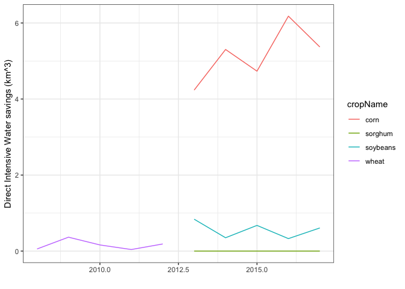

Goal: Use derived data summaries to calculate relative proportion of water saved. May have some vestigial data processing copied from the 05.31_Figures_cropIrrChoices.Rmd, where this analysis originated.


**R Packages Needed**


```r
library(dplyr)
library(ggplot2)
library(readr)
library(tidyr)

# filepath to repo on local system
mainDir <- '/Users/deinesji/Documents/code_git/1phd/DeinesEtAl2019_ERL_lema1'

sessionInfo()
```

```
## R version 3.5.1 (2018-07-02)
## Platform: x86_64-apple-darwin15.6.0 (64-bit)
## Running under: macOS  10.14
## 
## Matrix products: default
## BLAS: /Library/Frameworks/R.framework/Versions/3.5/Resources/lib/libRblas.0.dylib
## LAPACK: /Library/Frameworks/R.framework/Versions/3.5/Resources/lib/libRlapack.dylib
## 
## locale:
## [1] en_US.UTF-8/en_US.UTF-8/en_US.UTF-8/C/en_US.UTF-8/en_US.UTF-8
## 
## attached base packages:
## [1] stats     graphics  grDevices utils     datasets  methods   base     
## 
## other attached packages:
## [1] tidyr_0.8.1   readr_1.1.1   ggplot2_3.1.0 dplyr_0.7.6  
## 
## loaded via a namespace (and not attached):
##  [1] Rcpp_0.12.19     knitr_1.20       bindr_0.1.1      magrittr_1.5    
##  [5] hms_0.4.2        munsell_0.5.0    tidyselect_0.2.4 colorspace_1.3-2
##  [9] R6_2.2.2         rlang_0.2.2      plyr_1.8.4       stringr_1.3.1   
## [13] tools_3.5.1      grid_3.5.1       gtable_0.2.0     withr_2.1.2     
## [17] htmltools_0.3.6  lazyeval_0.2.1   yaml_2.2.0       assertthat_0.2.0
## [21] rprojroot_1.3-2  digest_0.6.16    tibble_1.4.2     crayon_1.3.4    
## [25] bindrcpp_0.2.2   purrr_0.2.5      glue_1.3.0       evaluate_0.11   
## [29] rmarkdown_1.10   stringi_1.2.4    compiler_3.5.1   pillar_1.3.0    
## [33] scales_1.0.0     backports_1.1.2  pkgconfig_2.0.2
```

# load and process data

## irrigated area totals
master data file created in 00.40_makeMasterDataFile.Rmd


```r
dataDir <- paste0(mainDir, '/data/tabular')
masterName <- 'masterTidyData_Wide_20181018.csv'

# load
master0 <- read_csv(paste0(dataDir, '/', masterName)) 
```

```
## Parsed with column specification:
## cols(
##   .default = col_double(),
##   masterid = col_character()
## )
```

```
## See spec(...) for full column specifications.
```

```r
# add a column for presence of LEMA program
lemaKey <- data.frame(Year = 1996:2017,
                      isLema = c(rep('before',17),rep('post',5)))
master <- master0 %>%
  left_join(lemaKey, by = 'Year')

# crop choices: subset for 5 year before/after
master5 <- master %>% 
  filter(Year > 2007) 

# rearrange: make crop type and irrigation status columns
cropTypes <- master5 %>% 
  dplyr::select(c(masterid, Year, isLema, Alfalfa_irrigated_ha, Alfalfa_rainfed_ha,
           Corn_irrigated_ha, Corn_rainfed_ha, Sorghum_irrigated_ha, 
           Sorghum_rainfed_ha, Soybeans_irrigated_ha, Soybeans_rainfed_ha,
           WinterWheat_irrigated_ha, WinterWheat_rainfed_ha)) %>%
  gather(., key = item, value = value,
         Alfalfa_irrigated_ha:WinterWheat_rainfed_ha) %>%
  tidyr::separate(item, c('cropType','status','unit'), sep='_') 

# and get totals
cropTypeTotals <- cropTypes %>%
  group_by(masterid, Year, isLema, cropType) %>%
  summarize(value = sum(value)) 

# extract totals data
irrTotals <- master5 %>% 
  dplyr::select(c(masterid, Year, isLema, wimasIrrArea_ha, aimIrr_ha)) %>%
  gather(., key = dataset, value = value,
         wimasIrrArea_ha:aimIrr_ha) 

# make a data frame defining line segments for means (from plotting script)
timeKey <- data.frame(isLema = c('before','post'),
                      x1 = c(-Inf, 2013),
                      xend = c(2012.2, Inf))
regionNames <- data.frame(masterid = c('sheridan','null_geo9'),
                          region = c('LEMA','Control'))
dataNames <- data.frame(dataset = c('wimasIrrArea_ha','aimIrr_ha'),
                          datasetLabel = c('WIMAS','AIM'))

irrMeansTotal <- irrTotals %>% 
  group_by(masterid, isLema, dataset) %>%
  summarize(meanVal = mean(value, na.rm=TRUE)) %>%
  left_join(timeKey, by = 'isLema') %>%
  left_join(regionNames, by = 'masterid') %>%
  left_join(dataNames, by = 'dataset')
```

```
## Warning: Column `masterid` joining character vector and factor, coercing
## into character vector
```

```
## Warning: Column `dataset` joining character vector and factor, coercing
## into character vector
```

```r
irrTotals2 <- irrTotals %>% 
  left_join(regionNames, by = 'masterid') %>%
  left_join(dataNames, by = 'dataset')
```

```
## Warning: Column `masterid` joining character vector and factor, coercing
## into character vector

## Warning: Column `dataset` joining character vector and factor, coercing
## into character vector
```

## Irrigated Area by Crop
break it down by crop


```r
cropTypesWheat <- cropTypes %>%
    filter(cropType %in% c('Corn','Soybeans','Sorghum', 'WinterWheat'))

# make a data frame defining line segments for means
timeKey <- data.frame(isLema = c('before','post'),
                      x1 = c(-Inf, 2013),
                      xend = c(2012.2, Inf))
regionNames <- data.frame(masterid = c('sheridan','null_geo9'),
                          region = c('LEMA','Control'))

irrMeansWheat <- cropTypesWheat %>% 
  filter(status == 'irrigated') %>%
  group_by(masterid, isLema, cropType) %>%
  summarize(meanVal = mean(value)) %>%
  left_join(timeKey, by = 'isLema') %>%
  left_join(regionNames, by = 'masterid')
```

```
## Warning: Column `masterid` joining character vector and factor, coercing
## into character vector
```

```r
cropTypes2 <- cropTypesWheat %>% left_join(regionNames, by = 'masterid')
```

```
## Warning: Column `masterid` joining character vector and factor, coercing
## into character vector
```

## WIMAS: crop water applied
uses formatted wimas data from 04.01_wells_WIMAS.Rmd, replicates processing in 5.4_analyses_cropWaterApplied.Rmd


```r
# wimas ---------------------------------------------------
wellDir <- paste0(mainDir, '/data/wellData/WIMAS_AnthonyCleaned_JillFormatted')

# load cleaned well data 
wells<- read_csv(paste0(wellDir,
                  '/WIMAS_1996-2017_SheridanNull9_convertedUnits_noPDIV_ID.csv'))
```

```
## Parsed with column specification:
## cols(
##   masterid = col_character(),
##   year = col_integer(),
##   crop = col_integer(),
##   volume_m3 = col_double(),
##   area_m2 = col_double(),
##   depth_m = col_double(),
##   system = col_integer()
## )
```

```r
# add a column for presence of LEMA program
lemaKey <- data.frame(year = 1996:2017,
                      isLema = c(rep('before',17),rep('post',5)))
wellsPeriod <- wells %>%
  left_join(lemaKey, by = 'year')

# remove NA's and subset
wellsComplete <- wellsPeriod[!is.na(wellsPeriod$volume_m3),]

# crop key
cropKey <- data.frame(cropName = c('corn','sorghum','soybeans','wheat'),
                      crop = c(2,3,4,5))

# mean depths by period
statsByCrop <- wellsComplete %>%
  right_join(cropKey, by = 'crop') %>%
  filter(year > 2007) %>%
  group_by(masterid, cropName, isLema, year) %>%
  # first get annual means
  summarise(meanAnnualDepth_cm = mean(depth_m*100),
            count = n()) %>%
  # then get period means
  summarise(meanDepth_cm = mean(meanAnnualDepth_cm),
            count = sum(count))

# mean depth by year
annualDepths <- wellsComplete %>%
  filter(year > 2007) %>%
  right_join(cropKey, by = 'crop') %>%
  group_by(masterid, cropName, year) %>%
  summarise(meanDepth_cm = mean(depth_m*100))


# make a data frame defining line segments for means
timeKey <- data.frame(isLema = c('before','post'),
                      x1 = c(-Inf, 2013),
                      xend = c(2012.2, 2017.2))
regionNames <- data.frame(masterid = c('sheridan','null_geo9'),
                          region = c('LEMA','Control'))

periodMeans0 <- statsByCrop %>% 
  left_join(timeKey, by = 'isLema') %>%
  left_join(regionNames, by = 'masterid')
```

```
## Warning: Column `masterid` joining character vector and factor, coercing
## into character vector
```

```r
# add in the mean sorghum depth for 2002-2012 for LEMA
sorghumPreLema <- data.frame(masterid = 'sheridan', cropName = 'sorghum',
                             isLema = 'before', meanDepth_cm = 16.4,
                             count = 0, x1 = as.numeric(-Inf), xend = 2012.2,
                             region = 'LEMA')
periodMeans <- periodMeans0 %>% bind_rows(sorghumPreLema)
```

```
## Warning in bind_rows_(x, .id): binding character and factor vector,
## coercing into character vector
```

```
## Warning in bind_rows_(x, .id): Unequal factor levels: coercing to character
```

```
## Warning in bind_rows_(x, .id): binding character and factor vector,
## coercing into character vector

## Warning in bind_rows_(x, .id): binding character and factor vector,
## coercing into character vector
```

```
## Warning in bind_rows_(x, .id): Unequal factor levels: coercing to character
```

```
## Warning in bind_rows_(x, .id): binding character and factor vector,
## coercing into character vector

## Warning in bind_rows_(x, .id): binding character and factor vector,
## coercing into character vector
```

```
## Warning in bind_rows_(x, .id): Unequal factor levels: coercing to character
```

```
## Warning in bind_rows_(x, .id): binding character and factor vector,
## coercing into character vector

## Warning in bind_rows_(x, .id): binding character and factor vector,
## coercing into character vector
```

```r
annualDepths2 <- annualDepths %>% left_join(regionNames, by = 'masterid')
```

```
## Warning: Column `masterid` joining character vector and factor, coercing
## into character vector
```

# Calculate Relative Contributions
Approach estimates effects for the full 5 year period.

## Direct intensive margin

Direct intensive margin: water saved by less water per crop. LEMA-caused reductions taken from causal impact models in 03.00_analyses_cropWaterApplied.Rmd. Sorghum assumed to be zero given non-significant result.

Corn and soy are straightforward, since the area was reduced from pre-LEMA times. So all remaining corn and soy area counts as area over which the depth savings apply.

Sorghum - LEMA didn't save any water over sorghum, so only have to deal with sorghum in the indirect intensive margin.

Wheat is tough - existing area would get some direct intensive savings (44% at that!), but much of the post-LEMA wheat area is indirect from increase in area from previous soy/corn fields. Solution: replace wheat number with the pre-LEMA area... ultimately, the area of wheat is quite small, so this isn't a huge factor.

Water saved per crop per year: extract crop areas for Sheridan LEMA period and apply per-area crop savings from causalImpact model


```r
# join data for means and depths
cropKey$cropType <- c('Corn','Sorghum','Soybeans','WinterWheat') 
cropKey$ciSavings_cm <- c(8.6,0,5.8,8.7)

# get corn, soy, wheat numbers from Sheridan LEMA
annualDirect0 <- cropTypes2 %>%
  left_join(cropKey, by = 'cropType') %>%
  filter(region == 'LEMA' & 
           isLema == 'post' & 
           status == 'irrigated' &
           cropName != 'wheat') %>%
  dplyr::select(c(Year,cropName, value, ciSavings_cm)) %>%
  rename(area_ha = value) %>%
  mutate(directSaved_m3 = area_ha*1e4 * ciSavings_cm*1e-2)

# use null lema for wheat
wheatSubstitute <- cropTypes2 %>%
  left_join(cropKey, by = 'cropType') %>%
  filter(region == 'LEMA' & 
           isLema == 'before' & 
           status == 'irrigated' &
           cropName == 'wheat') %>%
  dplyr::select(c(Year,cropName, value, ciSavings_cm)) %>%
  rename(area_ha = value) %>%
  mutate(directSaved_m3 = area_ha*1e4 * ciSavings_cm*1e-2)

annualDirect <- annualDirect0 %>% bind_rows(wheatSubstitute)

ggplot(annualDirect,
       aes(x = Year, y = directSaved_m3*1e-6, color = cropName)) +
  geom_line() +
  xlab('') + ylab('Direct Intensive Water savings (km^3)') +
  theme_bw()
```

<!-- -->

```r
# get aggregate water savings: 5 year
direct5year <- annualDirect %>%
  filter(cropName %in% c('corn','soybeans','wheat')) %>%
  group_by(cropName) %>%
  summarise(km3_saved = sum(directSaved_m3)*1e-6)
direct5year
```

```
## # A tibble: 3 x 2
##   cropName km3_saved
##   <fct>        <dbl>
## 1 corn        25.8  
## 2 soybeans     2.80 
## 3 wheat        0.811
```

```r
sum(direct5year$km3_saved)
```

```
## [1] 29.43355
```

```r
# store water saved via irrigation depths for totals below
waterEfficiencySavings <- sum(direct5year$km3_saved)

# corn's influence
direct5year[direct5year$cropName=='corn','km3_saved']/waterEfficiencySavings
```

```
##   km3_saved
## 1 0.8772721
```


## Indirect Intensive Margin
Using post-LEMA irrigation depths (since we're talking about water saved during the LEMA period - essentially calculatig a hypothetical water volume that would have been used had crops not changed), compare water use for the mean crop mix (mean area of each crop) pre-LEMA and post-LEMA. This gives an annual estimate; multiple by number of years to get full effect.


```r
# combine mean data summaries and extract Sheridan
combined <- irrMeansWheat %>%
   ungroup() %>%
   left_join(cropKey, by = 'cropType') %>%
   dplyr::select(-c(x1, xend,masterid,cropType, crop)) %>%
   rename(meanArea_ha = meanVal) %>%
   left_join(periodMeans %>% 
               ungroup() %>% dplyr::select(-c(masterid,x1,xend)),
             by = c('region','isLema','cropName')) %>%
  filter(region == 'LEMA') %>%
  # reorder
  dplyr::select(c(region, isLema, cropName, meanArea_ha, meanDepth_cm))
```

```
## Warning: Column `region` joining factor and character vector, coercing into
## character vector
```

```
## Warning: Column `isLema` joining factor and character vector, coercing into
## character vector
```

```
## Warning: Column `cropName` joining factor and character vector, coercing
## into character vector
```

```r
# calculate irrigation water used post-LEMA: post crop areas, post depths
postVolume <- combined %>%
  filter(isLema == 'post') %>%
  mutate(volume_m3 = meanArea_ha*1e4 * meanDepth_cm*1e-2) %>%
  summarise(total_km3 = sum(volume_m3)*1e-6)
postVolume
```

```
## # A tibble: 1 x 1
##   total_km3
##       <dbl>
## 1      20.3
```

```r
postVolume*5
```

```
##   total_km3
## 1  101.4703
```

```r
# calculate calculate hypothetical water volume had crops not changed
# pre crops, post depths
preCropsHypotheticalVolume <- combined %>%
  # get pre-lema crop areas
  filter(isLema == 'before') %>%
  dplyr::select(c(cropName,meanArea_ha)) %>%
  # and post lema depths
  left_join(combined %>%
              filter(isLema == 'post') %>%
              dplyr::select(c(cropName, meanDepth_cm)),
            by = 'cropName') %>%
  mutate(volume_m3 = meanArea_ha*1e4 * meanDepth_cm*1e-2) %>%
  summarise(total_km3 = sum(volume_m3)*1e-6)
preCropsHypotheticalVolume
```

```
## # A tibble: 1 x 1
##   total_km3
##       <dbl>
## 1      21.9
```

```r
preCropsHypotheticalVolume * 5
```

```
##   total_km3
## 1  109.3207
```

```r
# 5 year difference
cropChangeSavings <- preCropsHypotheticalVolume * 5 - postVolume*5
cropChangeSavings
```

```
##   total_km3
## 1  7.850374
```

```r
# second approach check - rewrote equation for manuscript, make sure this
# method comes to the same answer

cropDepths <- combined %>% 
           filter(isLema == 'post') %>% 
           dplyr::select(c(cropName,meanDepth_cm))

#get areal differences by crop type, then multiply by depth
areaDifs <- combined %>% 
  ungroup() %>%
  dplyr::select(-c(region, meanDepth_cm)) %>%
  tidyr::spread(., key = isLema, value = meanArea_ha) %>%
  mutate(cropDiff = before - post) %>%
  left_join(cropDepths, by ='cropName') %>%
  mutate(waterchange_m3 = cropDiff*1e4 * meanDepth_cm*1e-2) %>%
  summarise(annualTotal_km3 = sum(waterchange_m3*1e-6))
areaDifs
```

```
## # A tibble: 1 x 1
##   annualTotal_km3
##             <dbl>
## 1            1.57
```

```r
areaDifs*5
```

```
##   annualTotal_km3
## 1        7.850374
```

## Extensive margin savings
Changes from changes in total irrigated area, Based on mean depth overall


```r
# get mean depth for Sheridan LEMA irrigation, based on wimas + aim
meanDepthAll <- master %>%
  filter(isLema == 'post' & masterid == 'sheridan') %>%
  dplyr::select(c(masterid, Year, wimasVol_km3, wimasIrrArea_ha, aimIrr_ha)) %>%
  mutate(depthWimas_m = (wimasVol_km3*1e6) / (wimasIrrArea_ha*1e4),
         depthAim_m = (wimasVol_km3*1e6) / (aimIrr_ha*1e4)) %>%
  summarise(meanDepthzWimas_m = mean(depthWimas_m, na.rm=TRUE),
            meanDepthAim_m = mean(depthAim_m, na.rm=TRUE)) %>%
  t()
meanDepthAll <- as.data.frame(meanDepthAll)
names(meanDepthAll) <- 'meanDepth_m'
meanDepthAll$dataset <- c('wimasIrrArea_ha', 'aimIrr_ha')
meanDepthAll
```

```
##                   meanDepth_m         dataset
## meanDepthzWimas_m   0.2311001 wimasIrrArea_ha
## meanDepthAim_m      0.2526961       aimIrr_ha
```

```r
# get mean of both datasets ***********
# this represents mean irrigation depth
mean(meanDepthAll$meanDepth_m)
```

```
## [1] 0.2418981
```

```r
# mean volumes based on pre- and post-lema irrigated areas, mean lema depth
umm <- irrMeansTotal %>% 
  ungroup() %>%
  filter(masterid == 'sheridan') %>%
  left_join(meanDepthAll, by = 'dataset') %>%
  dplyr::select(c(isLema, meanVal, meanDepth_m)) %>%
  # GET MEAN DEPTH AND MEAN AREA between WIMAS/AIM
  group_by(isLema) %>%
  summarise_all(mean) %>%
  mutate(meanVolume_km3 = meanVal*1e4 * meanDepth_m * 1e-6)

# water savings over  5  years 
umm$meanVolume_km3[1]*5 - umm$meanVolume_km3[2]*5  
```

```
## [1] 3.809974
```

```r
# store as variable for summary below
extensiveSavings <- umm$meanVolume_km3[1]*5 - umm$meanVolume_km3[2]*5  
```

## Summarize savings

### Based on 5 years
multiplying mean annual savings by 5. 


```r
# savings in km ^3
waterEfficiencySavings
```

```
## [1] 29.43355
```

```r
cropChangeSavings
```

```
##   total_km3
## 1  7.850374
```

```r
extensiveSavings
```

```
## [1] 3.809974
```

```r
# precentages ------------------------
total2 <- extensiveSavings + waterEfficiencySavings + cropChangeSavings
total2
```

```
##   total_km3
## 1   41.0939
```

```r
# percent extensive
extensiveSavings/total2 * 100
```

```
##   total_km3
## 1  9.271386
```

```r
# percent direct intensive - depth
waterEfficiencySavings/total2 * 100
```

```
##   total_km3
## 1  71.62511
```

```r
# percent indirect intensive
cropChangeSavings/ total2 * 100
```

```
##   total_km3
## 1   19.1035
```


