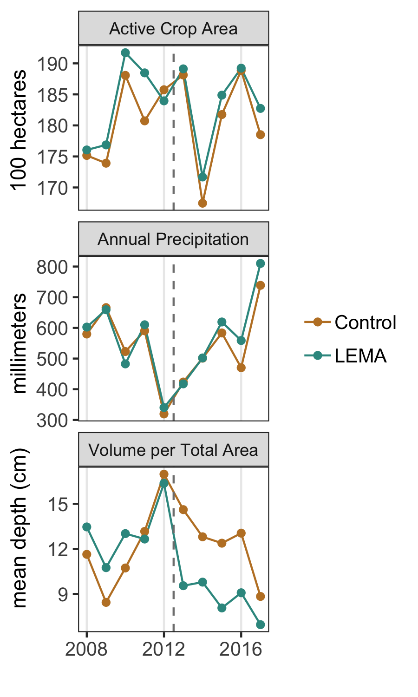
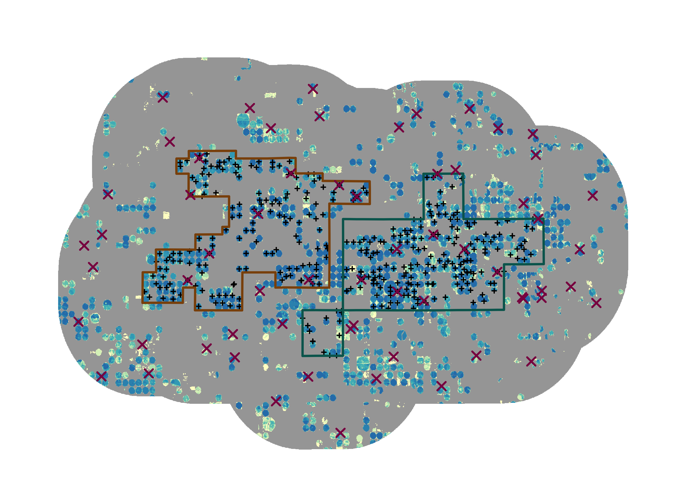

Goal: Make study area figure. This produces necessary sub-components of Figure 1. Final composition was done in Adobe Illustrator.


**R Packages Needed**


```r
library(tidyverse)
library(rgdal)
library(raster)
library(RColorBrewer)
library(latticeExtra)
library(fields)
library(sf)

# filepath to repo on local system
mainDir <- '/Users/deinesji/Documents/code_git/1phd/DeinesEtAl2019_ERL_lema1'

sessionInfo()
```

```
## R version 3.5.1 (2018-07-02)
## Platform: x86_64-apple-darwin15.6.0 (64-bit)
## Running under: macOS  10.14
## 
## Matrix products: default
## BLAS: /Library/Frameworks/R.framework/Versions/3.5/Resources/lib/libRblas.0.dylib
## LAPACK: /Library/Frameworks/R.framework/Versions/3.5/Resources/lib/libRlapack.dylib
## 
## locale:
## [1] en_US.UTF-8/en_US.UTF-8/en_US.UTF-8/C/en_US.UTF-8/en_US.UTF-8
## 
## attached base packages:
## [1] grid      stats     graphics  grDevices utils     datasets  methods  
## [8] base     
## 
## other attached packages:
##  [1] sf_0.6-3            fields_9.6          maps_3.3.0         
##  [4] spam_2.2-0          dotCall64_1.0-0     latticeExtra_0.6-28
##  [7] lattice_0.20-35     RColorBrewer_1.1-2  raster_2.6-7       
## [10] rgdal_1.3-4         sp_1.3-1            forcats_0.3.0      
## [13] stringr_1.3.1       dplyr_0.7.6         purrr_0.2.5        
## [16] readr_1.1.1         tidyr_0.8.1         tibble_1.4.2       
## [19] ggplot2_3.1.0       tidyverse_1.2.1    
## 
## loaded via a namespace (and not attached):
##  [1] tidyselect_0.2.4 haven_1.1.2      colorspace_1.3-2 htmltools_0.3.6 
##  [5] yaml_2.2.0       rlang_0.2.2      e1071_1.7-0      pillar_1.3.0    
##  [9] DBI_1.0.0        glue_1.3.0       withr_2.1.2      modelr_0.1.2    
## [13] readxl_1.1.0     bindrcpp_0.2.2   bindr_0.1.1      plyr_1.8.4      
## [17] munsell_0.5.0    gtable_0.2.0     cellranger_1.1.0 rvest_0.3.2     
## [21] evaluate_0.11    knitr_1.20       class_7.3-14     broom_0.5.0     
## [25] Rcpp_0.12.19     classInt_0.2-3   scales_1.0.0     backports_1.1.2 
## [29] jsonlite_1.5     hms_0.4.2        digest_0.6.16    stringi_1.2.4   
## [33] rprojroot_1.3-2  cli_1.0.0        tools_3.5.1      magrittr_1.5    
## [37] lazyeval_0.2.1   crayon_1.3.4     pkgconfig_2.0.2  xml2_1.2.0      
## [41] spData_0.2.9.3   lubridate_1.7.4  assertthat_0.2.0 rmarkdown_1.10  
## [45] httr_1.3.1       rstudioapi_0.7   R6_2.2.2         units_0.6-1     
## [49] nlme_3.1-137     compiler_3.5.1
```

# Insets

## Prep Data


```r
dataDir <- paste0(mainDir, '/data/tabular')
masterName <- 'masterTidyData_Wide_20181018.csv'

# load
master0 <- read_csv(paste0(dataDir, '/', masterName)) 
```

```
## Parsed with column specification:
## cols(
##   .default = col_double(),
##   masterid = col_character()
## )
```

```
## See spec(...) for full column specifications.
```

```r
# pre, crop, volume per area for 5 years before and after
studyChar <- master0 %>% 
  filter(Year > 2007) %>%
  mutate(vpa_cm = (wimasVol_km3*1e6)/(totalArea_ha*1e4)*100,
         cropActive_100ha = cropActive_ha / 100) %>%
  dplyr::select(c(masterid, Year, pr_calendar_mm, cropActive_100ha, vpa_cm)) %>%
  tidyr::gather(., key = variable, value = value, pr_calendar_mm:vpa_cm)
```

## study area characteristic plots


```r
# add plotable names
plotable <- data.frame(variable = c('pr_calendar_mm','cropActive_100ha','vpa_cm'),
                       plotName = c('Annual Precipitation','Active Crop Area',
                                    'Volume per Total Area'))
regionNames <- data.frame(masterid = c('sheridan','null_geo9'),
                          region = c('LEMA','Control'))

studyChar1 <- studyChar %>% 
  left_join(plotable, by = 'variable') %>%
  left_join(regionNames, by = 'masterid')
```

```
## Warning: Column `variable` joining character vector and factor, coercing
## into character vector
```

```
## Warning: Column `masterid` joining character vector and factor, coercing
## into character vector
```

```r
# plot
ggplot(studyChar1,
       aes(x=Year, y = value, color = region)) +
  geom_line() +
  geom_point() +
  facet_wrap(~plotName, scale = 'free_y', nrow = 3) +
  geom_vline(xintercept = 2012.5, color = 'gray50', linetype = 'dashed') +
  scale_x_continuous(breaks=c(2008, 2012, 2016)) +
  scale_color_manual(values=rev(c("#35978f", "#bf812d"))) +
  xlab('') + ylab('mean depth (cm)         millimeters                 100 hectares') +
  theme_bw() + theme(legend.title=element_blank(),
                     strip.background=element_rect(fill = 'gray88'), # comment to add labels
                     #strip.text.x = element_blank(),   # comment to add labels
                     axis.text=element_text(size=10),
                     legend.text=element_text(size=10),
                     axis.title=element_text(size=11),
                     panel.grid.major.y = element_blank(),
                     panel.grid.minor.y = element_blank(),
                     panel.grid.minor.x = element_blank())
```

<!-- -->

# Map:prep

## Boundaries


```r
gisDir <- paste0(mainDir, '/data/GIS')

# use the HPA-CLASS project projection
classProj <- '+proj=aea +lat_1=20 +lat_2=60 +lat_0=40 +lon_0=-101 +x_0=0 +y_0=0 +datum=NAD83 +units=m +no_defs +ellps=GRS80 +towgs84=0,0,0'

# extract Sheridan and Control polygons
bounds <- readOGR(paste0(gisDir,'/boundaries'),
                  'Combined_Null9_S6_10kmBuff_indvlPolys', verbose = FALSE)
boundsProj <- spTransform(bounds, CRS(classProj))
sheridan <- boundsProj[boundsProj$masterid == 'sheridan',]
control <- boundsProj[boundsProj$masterid == 'null_geo9',]

# load buf
buffer0 <- readOGR(paste0(gisDir,'/boundaries'),
                  'Combined_Null9_S6_10kmBuff', verbose = FALSE)
buffer <- spTransform(buffer0, CRS(classProj))
```

## Irrigation Raster
AIM-RRB frequency from 2008-2017 filtered for pixels irrigated more than 1 time in this period in GEE, and masked with KS place of use tracts

### Reformat once


```r
# load, reproject, mask
irrRas0 <- raster(paste0(gisDir, '/aimrrb_frequency_2008-2017_TractMaskedGiFixed_10kmbuff.tif'))
irrRas <- projectRaster(irrRas0, res = 30, crs = classProj, method = 'ngb')
irrRasMask <- mask(irrRas, boundsProj)

writeRaster(irrRasMask, 
            paste0(gisDir, '/aimrrb_frequency_2008-2017_TractMaskedGiFixed_10kmbuff_masked.tif'),
            datatype = 'INT1U')
```


### load ras


```r
irrFreq <- raster(paste0(
  gisDir, '/aimrrb_frequency_2008-2017_TractMaskedGiFixed_10kmbuff_masked.tif'))
```

## Wells
Load WIZARD and WIMAS locations, reproject


```r
wellDir <- paste0(mainDir, '/data/wellData')

# wizard water levels: unique wells
wizard <- readOGR(paste0(wellDir, '/WIZARD/cleaned'),
                  'wizard_unique_waterLevelWellLocations_1996-2017', verbose = FALSE )

# wimas water use: unique wells
wimas <- readOGR(paste0(wellDir,'/WIMAS_AnthonyCleaned_JillFormatted'),
                   'wimas_uniqueLocations_1996-2017', verbose = F)
```

Note there are 63 unique wizard wells during this time period (not each year) for the full buffer region.

There are 365 unique WIMAS wells during this period in Sheridan and the Control region (203 in Sheridan, 162 in control).

# Map It

## Zoomed Map
No lines, etc


```r
backgroundCol <- 'gray65'
colPal <- colorRampPalette(brewer.pal(5, 'YlGnBu')[1:4])

controlCol <- '#8c510a'  
sheridanCol <-  '#01665e' 

spplot(irrFreq, col.regions = c(backgroundCol, colPal(9)), at = c(0,2:10),
      par.settings=list(axis.line=list(col=NA)), colorkey = F,
       maxpixels = 2000000) +
  latticeExtra::layer(sp.points(wimas, col = 'black', cex = .3)) +
  latticeExtra::layer(sp.polygons(sheridan, col = sheridanCol, lwd=1.8)) +
  latticeExtra::layer(sp.polygons(control, col = controlCol, lty=1, lwd = 1.8)) +
  latticeExtra::layer(sp.points(wizard, col='deeppink4', pch = 4, lwd=1.5)) 
```

<!-- -->

### Scale bar
Ghetto way to get a scale bar into Adobe Illustrator (to get a properly sized pdf - pdf rasters look bad). Colors and pixel size irrelevant here


```r
backgroundCol <- 'gray65'
colPal <- colorRampPalette(brewer.pal(5, 'YlGnBu')[1:4])

# plot scale
scale = list("SpatialPolygonsRescale", layout.scale.bar(), 
  offset = c(35000,-88000), scale = 10000, fill=c("transparent","black"))
text1 = list("sp.text", c(34500,-90000), "0", cex=1)
text2 = list("sp.text", c(47500,-90000), "10 km",cex = 1)

spplot(irrFreq, col.regions = c(backgroundCol, colPal(9)), at = c(0,2:10),
      sp.layout=list(scale, text1, text2), 
      par.settings=list(axis.line=list(col=NA)), 
      colorkey = F, maxpixels = 2000)# scales = list(draw = TRUE)) 
```

<!-- -->

### Irr Frequency Scale
Make a colorkey. Separate from the distance scale bar above since adding the colorscale resizes the main plot map

#### Bottom smaller?


```r
backgroundCol <- 'gray65'

image.plot(z=1:10,add=F,legend.only=T,  col=c(backgroundCol,colPal(9)), 
           horizontal = T,
          smallplot=c(0.08,.902,.13,.18), 
         axis.args=list(at=c(1,2,4,6,8,10), 
                          labels=as.character(c(0,2,4,6,8,10))))
```

```
## Warning in par(new = TRUE, pty = "m", plt = smallplot, err = -1): calling
## par(new=TRUE) with no plot
```

<!-- -->


