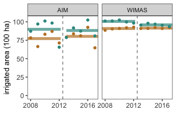
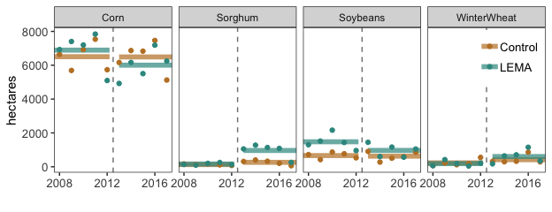
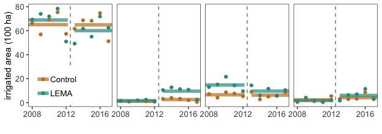
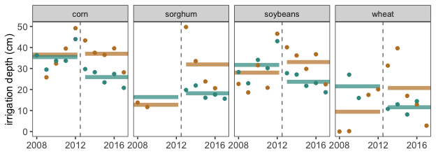

Goal: Make plot components for figure showing cropping and irrigation changes. Final composition of Figure 3 done in Adobe Illustrator.


**R Packages Needed**


```r
library(tidyverse)

# filepath to repo on local system
mainDir <- '/Users/deinesji/Documents/code_git/1phd/DeinesEtAl2019_ERL_lema1'

sessionInfo()
```

```
## R version 3.5.1 (2018-07-02)
## Platform: x86_64-apple-darwin15.6.0 (64-bit)
## Running under: macOS  10.14
## 
## Matrix products: default
## BLAS: /Library/Frameworks/R.framework/Versions/3.5/Resources/lib/libRblas.0.dylib
## LAPACK: /Library/Frameworks/R.framework/Versions/3.5/Resources/lib/libRlapack.dylib
## 
## locale:
## [1] en_US.UTF-8/en_US.UTF-8/en_US.UTF-8/C/en_US.UTF-8/en_US.UTF-8
## 
## attached base packages:
## [1] stats     graphics  grDevices utils     datasets  methods   base     
## 
## other attached packages:
## [1] forcats_0.3.0   stringr_1.3.1   dplyr_0.7.6     purrr_0.2.5    
## [5] readr_1.1.1     tidyr_0.8.1     tibble_1.4.2    ggplot2_3.1.0  
## [9] tidyverse_1.2.1
## 
## loaded via a namespace (and not attached):
##  [1] Rcpp_0.12.19     cellranger_1.1.0 pillar_1.3.0     compiler_3.5.1  
##  [5] plyr_1.8.4       bindr_0.1.1      tools_3.5.1      digest_0.6.16   
##  [9] lubridate_1.7.4  jsonlite_1.5     evaluate_0.11    nlme_3.1-137    
## [13] gtable_0.2.0     lattice_0.20-35  pkgconfig_2.0.2  rlang_0.2.2     
## [17] cli_1.0.0        rstudioapi_0.7   yaml_2.2.0       haven_1.1.2     
## [21] bindrcpp_0.2.2   withr_2.1.2      xml2_1.2.0       httr_1.3.1      
## [25] knitr_1.20       hms_0.4.2        rprojroot_1.3-2  grid_3.5.1      
## [29] tidyselect_0.2.4 glue_1.3.0       R6_2.2.2         readxl_1.1.0    
## [33] rmarkdown_1.10   modelr_0.1.2     magrittr_1.5     backports_1.1.2 
## [37] scales_1.0.0     htmltools_0.3.6  rvest_0.3.2      assertthat_0.2.0
## [41] colorspace_1.3-2 stringi_1.2.4    lazyeval_0.2.1   munsell_0.5.0   
## [45] broom_0.5.0      crayon_1.3.4
```

# Irrigated area 
Plots that depict annual and period changes in main crops irrigated area based on CDL and AIM

## load data
master data file created in 00.40_makeMasterDataFile.Rmd


```r
dataDir <- paste0(mainDir, '/data/tabular')
masterName <- 'masterTidyData_Wide_20181018.csv'

# load
master0 <- read_csv(paste0(dataDir, '/', masterName)) 
```

```
## Parsed with column specification:
## cols(
##   .default = col_double(),
##   masterid = col_character()
## )
```

```
## See spec(...) for full column specifications.
```

```r
# add a column for presence of LEMA program
lemaKey <- data.frame(Year = 1996:2017,
                      isLema = c(rep('before',17),rep('post',5)))
master <- master0 %>%
  left_join(lemaKey, by = 'Year')

# crop choices: subset for 5 year before/after
master5 <- master %>% 
  filter(Year > 2007) 

# rearrange: make crop type and irrigation status columns
cropTypes <- master5 %>% 
  dplyr::select(c(masterid, Year, isLema, Alfalfa_irrigated_ha,
                  Alfalfa_rainfed_ha,
           Corn_irrigated_ha, Corn_rainfed_ha, Sorghum_irrigated_ha, 
           Sorghum_rainfed_ha, Soybeans_irrigated_ha, Soybeans_rainfed_ha,
           WinterWheat_irrigated_ha, WinterWheat_rainfed_ha)) %>%
  gather(., key = item, value = value,
         Alfalfa_irrigated_ha:WinterWheat_rainfed_ha) %>%
  tidyr::separate(item, c('cropType','status','unit'), sep='_') 

# and get totals
cropTypeTotals <- cropTypes %>%
  group_by(masterid, Year, isLema, cropType) %>%
  summarize(value = sum(value)) 
```

## Total Irrigated Area
wimas and aim


```r
# extract totals data
irrTotals <- master5 %>% 
  dplyr::select(c(masterid, Year, isLema, wimasIrrArea_ha, aimIrr_ha)) %>%
  gather(., key = dataset, value = value,
         wimasIrrArea_ha:aimIrr_ha) 

# make a data frame defining line segments for means
timeKey <- data.frame(isLema = c('before','post'),
                      x1 = c(-Inf, 2013),
                      xend = c(2012.2, Inf))
regionNames <- data.frame(masterid = c('sheridan','null_geo9'),
                          region = c('LEMA','Control'))
dataNames <- data.frame(dataset = c('wimasIrrArea_ha','aimIrr_ha'),
                          datasetLabel = c('WIMAS','AIM'))

irrMeansTotal <- irrTotals %>% 
  group_by(masterid, isLema, dataset) %>%
  summarize(meanVal = mean(value, na.rm=TRUE)) %>%
  left_join(timeKey, by = 'isLema') %>%
  left_join(regionNames, by = 'masterid') %>%
  left_join(dataNames, by = 'dataset')
```

```
## Warning: Column `masterid` joining character vector and factor, coercing
## into character vector
```

```
## Warning: Column `dataset` joining character vector and factor, coercing
## into character vector
```

```r
irrTotals2 <- irrTotals %>% 
  left_join(regionNames, by = 'masterid') %>%
  left_join(dataNames, by = 'dataset')
```

```
## Warning: Column `masterid` joining character vector and factor, coercing
## into character vector

## Warning: Column `dataset` joining character vector and factor, coercing
## into character vector
```

```r
# plot
ggplot(irrTotals2, 
       aes(x = Year, y = value/100, group = region, color = region)) +
  # underplot mean lines
  geom_segment(data = irrMeansTotal, 
               aes(x = x1, xend = xend, y=meanVal/100,yend=meanVal/100, color=region),
               lwd = 2, alpha = .7) +
  # annual values
  geom_point() +
 # geom_line() +
  # lema line
  geom_vline(xintercept = 2012.5, color = 'gray50', linetype = 'dashed') +
  # formatting
  facet_wrap(~datasetLabel, nrow=1) + 
  scale_x_continuous(breaks=c(2008, 2012, 2016)) +
  scale_color_manual(values=rev(c("#35978f", "#bf812d"))) +
  xlab('') + ylab('irrigated area (100 ha)') + ylim(0,103) +
  theme_bw()  + theme(legend.position='none',
                     axis.text=element_text(size=10),
                     legend.text=element_text(size=10),
                     axis.title=element_text(size=11),
                     panel.grid.major = element_blank(),
                     panel.grid.minor = element_blank())
```

<!-- -->


## Irrigated Area by Crop


```r
cropTypesWheat <- cropTypes %>%
    filter(cropType %in% c('Corn','Soybeans','Sorghum', 'WinterWheat'))

# make a data frame defining line segments for means
timeKey <- data.frame(isLema = c('before','post'),
                      x1 = c(-Inf, 2013),
                      xend = c(2012.2, Inf))
regionNames <- data.frame(masterid = c('sheridan','null_geo9'),
                          region = c('LEMA','Control'),
                          stringsAsFactors = FALSE)

irrMeansWheat <- cropTypesWheat %>% 
  filter(status == 'irrigated') %>%
  group_by(masterid, isLema, cropType) %>%
  summarize(meanVal = mean(value)) %>%
  left_join(timeKey, by = 'isLema') %>%
  left_join(regionNames, by = 'masterid')

cropTypes2 <- cropTypesWheat %>% left_join(regionNames, by = 'masterid')


# plot by irrigation status
ggplot(cropTypes2 %>% filter(status == 'irrigated'), 
       aes(x = Year, y = value, group = region, color = region)) +
  # underplot mean lines
  geom_segment(data = irrMeansWheat, 
               aes(x = x1, xend = xend, y=meanVal,yend=meanVal, color=region),
               lwd = 2, alpha = .7) +
  # annual values
  geom_point() +
  #geom_line() +
  # lema line
  geom_vline(xintercept = 2012.5, color = 'gray50', linetype = 'dashed') +
  # formatting
  facet_wrap(~cropType, nrow=1) + 
  scale_x_continuous(breaks=c(2008, 2012, 2016)) +
  scale_color_manual(values=rev(c("#35978f", "#bf812d"))) +
  xlab('') + ylab('hectares') +
  theme_bw()  + theme(legend.title=element_blank(),
                     legend.position=c(.925,.8),
                     axis.text=element_text(size=10),
                     legend.text=element_text(size=10),
                     axis.title=element_text(size=11),
                     panel.grid.major = element_blank(),
                     panel.grid.minor = element_blank())
```

<!-- -->


#### no facet strips


```r
# plot by irrigation status
ggplot(cropTypes2 %>% filter(status == 'irrigated'), 
       aes(x = Year, y = value/100, group = region, color = region)) +
  # underplot mean lines
  geom_segment(data = irrMeansWheat, 
               aes(x = x1, xend = xend, y=meanVal/100, yend=meanVal/100,
                   color=region),
               lwd = 2, alpha = .7) +
  # annual values
  geom_point() +
  #geom_line() +
  # lema line
  geom_vline(xintercept = 2012.5, color = 'gray50', linetype = 'dashed') +
  # formatting
  facet_wrap(~cropType, nrow=1) + 
  scale_x_continuous(breaks=c(2008, 2012, 2016)) +
  scale_color_manual(values=rev(c("#35978f", "#bf812d"))) +
  xlab('') + ylab('irrigated area (100 ha)') +
  theme_bw()  + theme(legend.title=element_blank(),
                     legend.position=c(.08,.2),                     strip.background=element_blank(), # comment to add labels
                     strip.text.x = element_blank(),   # comment to add labels
                     axis.text=element_text(size=10),
                     legend.text=element_text(size=10),
                     axis.title=element_text(size=11),
                     panel.grid.major = element_blank(),
                     panel.grid.minor = element_blank())
```

<!-- -->


# Crop Water Applied
Plots that depict annual and period changes in irrigation depth by crop. For means, first finds annual means, and then takes the 5-year mean from those

## load data
uses formatted wimas data from 00.35_wells_WIMAS.Rmd, replicates processing in 03.00_analyses_cropWaterApplied.Rmd


```r
# wimas ---------------------------------------------------
wellDir <- paste0(mainDir, '/data/wellData/WIMAS_AnthonyCleaned_JillFormatted')

# load cleaned well data 
wells<- read_csv(paste0(wellDir,
                  '/WIMAS_1996-2017_SheridanNull9_convertedUnits_noPDIV_ID.csv'))
```

```
## Parsed with column specification:
## cols(
##   masterid = col_character(),
##   year = col_integer(),
##   crop = col_integer(),
##   volume_m3 = col_double(),
##   area_m2 = col_double(),
##   depth_m = col_double(),
##   system = col_integer()
## )
```

```r
# add a column for presence of LEMA program
lemaKey <- data.frame(year = 1996:2017,
                      isLema = c(rep('before',17),rep('post',5)))
wellsPeriod <- wells %>%
  left_join(lemaKey, by = 'year')

# remove NA's and subset
wellsComplete <- wellsPeriod[!is.na(wellsPeriod$volume_m3),]

# crop key
cropKey <- data.frame(cropName = c('corn','sorghum','soybeans','wheat'),
                      crop = c(2,3,4,5))

# mean depths by period
statsByCrop <- wellsComplete %>%
  right_join(cropKey, by = 'crop') %>%
  filter(year > 2007) %>%
  group_by(masterid, cropName, isLema, year) %>%
  # first get annual means
  summarise(meanAnnualDepth_cm = mean(depth_m*100),
            count = n()) %>%
  # then get period means
  summarise(meanDepth_cm = mean(meanAnnualDepth_cm),
            count = sum(count))

# mean depth by year
annualDepths <- wellsComplete %>%
  filter(year > 2007) %>%
  right_join(cropKey, by = 'crop') %>%
  group_by(masterid, cropName, year, isLema) %>%
  summarise(meanDepth_cm = mean(depth_m*100))
```

## Format: match area plots


```r
# make a data frame defining line segments for means
timeKey <- data.frame(isLema = c('before','post'),
                      x1 = c(-Inf, 2013),
                      xend = c(2012.2, Inf))
regionNames <- data.frame(masterid = c('sheridan','null_geo9'),
                          region = c('LEMA','Control'))

periodMeans0 <- statsByCrop %>% 
  left_join(timeKey, by = 'isLema') %>%
  left_join(regionNames, by = 'masterid')
```

```
## Warning: Column `masterid` joining character vector and factor, coercing
## into character vector
```

```r
# add in the mean sorghum depth for 2002-2012 for LEMA
sorghumPreLema <- data.frame(masterid = 'sheridan', cropName = 'sorghum',
                             isLema = 'before', meanDepth_cm = 16.4,
                             count = 0, x1 = as.numeric(-Inf), xend = 2012.2,
                             region = 'LEMA')
periodMeans <- periodMeans0 %>% bind_rows(sorghumPreLema)
```

```
## Warning in bind_rows_(x, .id): binding character and factor vector,
## coercing into character vector
```

```
## Warning in bind_rows_(x, .id): Unequal factor levels: coercing to character
```

```
## Warning in bind_rows_(x, .id): binding character and factor vector,
## coercing into character vector

## Warning in bind_rows_(x, .id): binding character and factor vector,
## coercing into character vector
```

```
## Warning in bind_rows_(x, .id): Unequal factor levels: coercing to character
```

```
## Warning in bind_rows_(x, .id): binding character and factor vector,
## coercing into character vector

## Warning in bind_rows_(x, .id): binding character and factor vector,
## coercing into character vector
```

```
## Warning in bind_rows_(x, .id): Unequal factor levels: coercing to character
```

```
## Warning in bind_rows_(x, .id): binding character and factor vector,
## coercing into character vector

## Warning in bind_rows_(x, .id): binding character and factor vector,
## coercing into character vector
```

```r
annualDepths2 <- annualDepths %>% left_join(regionNames, by = 'masterid')
```

```
## Warning: Column `masterid` joining character vector and factor, coercing
## into character vector
```


```r
# plot by irrigation status
ggplot(annualDepths2, 
       aes(x = year, y = meanDepth_cm, group = region, color = region)) +
  # underplot mean lines
  geom_segment(data = periodMeans, 
               aes(x = x1, xend = xend, y=meanDepth_cm, yend=meanDepth_cm,
                   color=region), lwd = 2, alpha = .7) +
  # annual values
  geom_point() +
  #geom_line() +
  # lema line
  geom_vline(xintercept = 2012.5, color = 'gray50', linetype = 'dashed') +
  # formatting
  facet_wrap(~cropName, nrow=1) + 
  scale_x_continuous(breaks=c(2008, 2012, 2016), 
                     limits=c(2008,2017)) +
  scale_color_manual(values=rev(c("#35978f", "#bf812d"))) +
  xlab('') + ylab('irrigation depth (cm)') +
  theme_bw()  + theme(legend.position='none',
                     axis.text=element_text(size=10),
                     legend.text=element_text(size=10),
                     axis.title=element_text(size=11),
                     panel.grid.major = element_blank(),
                     panel.grid.minor = element_blank())
```

<!-- -->


