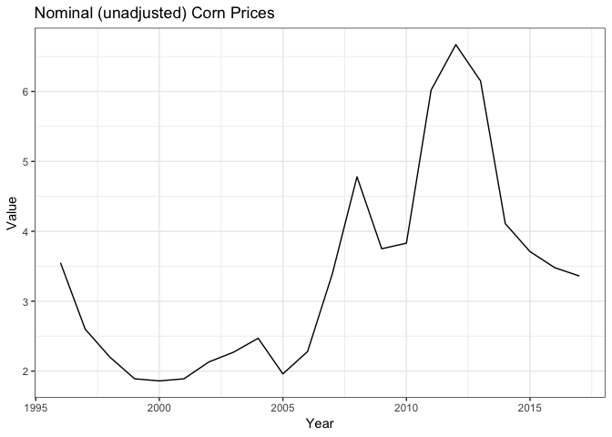
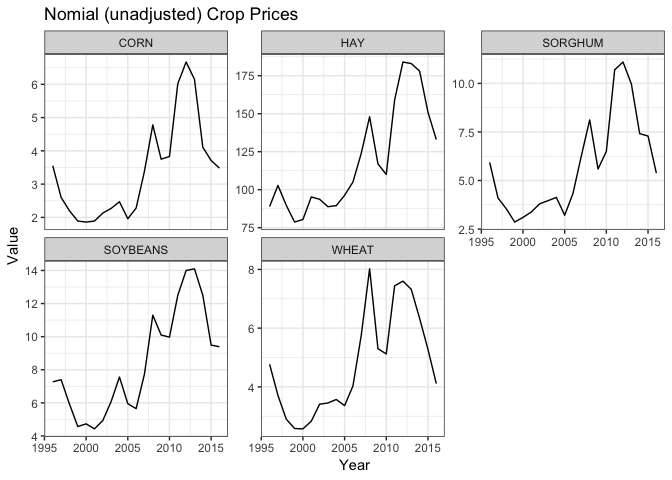
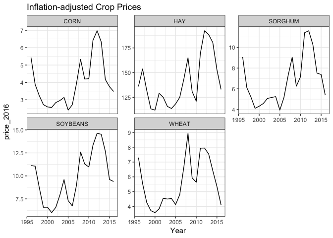

Goal: Get corn commodity prices for the study period, and adjust for inflation to 2017 dollars. Inflation adjustments are relative to 2017 and based on the CPI’s “Consumer Price Index for All Urban Consumers: All Items”


**R Packages Needed**


```r
library(tidyverse) # for ggplot2, tidyr, dplyr
library(lubridate)

library(Hmisc)

# filepath to repo on local system
mainDir <- '/Users/deinesji/Documents/code_git/1phd/DeinesEtAl2019_ERL_lema1'

sessionInfo()
```

```
## R version 3.5.1 (2018-07-02)
## Platform: x86_64-apple-darwin15.6.0 (64-bit)
## Running under: macOS  10.14
## 
## Matrix products: default
## BLAS: /Library/Frameworks/R.framework/Versions/3.5/Resources/lib/libRblas.0.dylib
## LAPACK: /Library/Frameworks/R.framework/Versions/3.5/Resources/lib/libRlapack.dylib
## 
## locale:
## [1] en_US.UTF-8/en_US.UTF-8/en_US.UTF-8/C/en_US.UTF-8/en_US.UTF-8
## 
## attached base packages:
## [1] stats     graphics  grDevices utils     datasets  methods   base     
## 
## other attached packages:
##  [1] Hmisc_4.1-1     Formula_1.2-3   survival_2.42-3 lattice_0.20-35
##  [5] lubridate_1.7.4 forcats_0.3.0   stringr_1.3.1   dplyr_0.7.6    
##  [9] purrr_0.2.5     readr_1.1.1     tidyr_0.8.1     tibble_1.4.2   
## [13] ggplot2_3.1.0   tidyverse_1.2.1 knitr_1.20     
## 
## loaded via a namespace (and not attached):
##  [1] Rcpp_0.12.19        assertthat_0.2.0    rprojroot_1.3-2    
##  [4] digest_0.6.16       R6_2.2.2            cellranger_1.1.0   
##  [7] plyr_1.8.4          backports_1.1.2     acepack_1.4.1      
## [10] evaluate_0.11       httr_1.3.1          pillar_1.3.0       
## [13] rlang_0.2.2         lazyeval_0.2.1      readxl_1.1.0       
## [16] rstudioapi_0.7      data.table_1.11.4   rpart_4.1-13       
## [19] Matrix_1.2-14       checkmate_1.8.5     rmarkdown_1.10     
## [22] splines_3.5.1       foreign_0.8-70      htmlwidgets_1.3    
## [25] munsell_0.5.0       broom_0.5.0         compiler_3.5.1     
## [28] modelr_0.1.2        pkgconfig_2.0.2     base64enc_0.1-3    
## [31] htmltools_0.3.6     nnet_7.3-12         tidyselect_0.2.4   
## [34] gridExtra_2.3       htmlTable_1.12      crayon_1.3.4       
## [37] withr_2.1.2         grid_3.5.1          nlme_3.1-137       
## [40] jsonlite_1.5        gtable_0.2.0        magrittr_1.5       
## [43] scales_1.0.0        cli_1.0.0           stringi_1.2.4      
## [46] bindrcpp_0.2.2      latticeExtra_0.6-28 xml2_1.2.0         
## [49] RColorBrewer_1.1-2  tools_3.5.1         glue_1.3.0         
## [52] hms_0.4.2           yaml_2.2.0          colorspace_1.3-2   
## [55] cluster_2.0.7-1     rvest_0.3.2         bindr_0.1.1        
## [58] haven_1.1.2
```

# User Vars


```r
# data directory
priceDir <- paste0(mainDir, '/data/tabular/commodityPrices')

# filename for inflation adjustment table (made in inflationTable chunk)
cpiFile <- 'cpi_priceAdjustments.csv'

# corn prices downloaded from NASS
nassRawFile <- 'NASS_corn_prices_1996-2017_raw.csv'
periodType <- 'YEAR'

# output file name
cornFileOut <- 'NASS_corn_prices_1996-2017_inflationAdjusted_2017dollars.csv'
```


# Price data
Price data was downloaded manually from the NASS quickstats tool (https://quickstats.nass.usda.gov/) for the following query: SURVEY - CROPS - FIELD CROPS - CORN/SOYBEANS/WHEAT/HAY/SORGHUM - PRICE RECEIVED - 

* CORN, GRAIN - PRICE RECEIVED, MEASURED IN $ / BU

- TOTAL - NATIONAL - US TOTAL - 1866:2017 - ANNUAL - YEAR

Here, I load the data and clean it to have consistent pricing across crops and years


```r
# load nass
price0 <- read.csv(paste0(priceDir, '/', nassRawFile)) %>% 
  filter(Period == periodType)

# load consumer price index adjustments
cpi <- read.csv(paste0(priceDir, '/',cpiFile))

# make a units columns (eh, extra doesnt)
unitkey <- data.frame(Commodity = c('CORN'),
                      unit = c('BU'))
price0 <- merge(price0,unitkey)

# remove silly columns
price0 <- price0[,c('Commodity','Year','Value','unit')]

# add the adjustment factor
price <- merge(price0, cpi[,c('cpi_year','adj_factor_2017')], 
               by.x = 'Year', by.y = 'cpi_year')

# adjust prices (note: matched trials at https://data.bls.gov/cgi-bin/cpicalc.pl)
price$price_2017 <- price$Value / price$adj_factor_2017

# plot it - unadjusted
ggplot(data = price, aes(x=Year, y = Value)) +
  geom_line() +
  theme_bw() +
  ggtitle('Nominal (unadjusted) Corn Prices') 
```

<!-- -->

```r
# plot it
ggplot(data = price, aes(x=Year, y = price_2017)) +
  geom_line() +
  theme_bw() +
  ggtitle('Inflation-adjusted Corn Prices')
```

<!-- -->

```r
# write out dataset
write.csv(price, paste0(priceDir, '/',cornFileOut), 
          row.names=F)
```


# compare price by commodity for review response
A review requested evidence for colinearity among crop prices. Here I use a dataset produced similar to above for Deines et al. 2017, GRL, to extract correlations. 


```r
# load nass
nassdir <- paste0(priceDir, '/price_5commodities_fromDeinesetal2017')
price0 <- read.csv(paste0(nassdir, '/nass_prices_5crops_national_1996-2016.csv'))

# load consumer price index adjustments
cpi <- read.csv(paste0(nassdir, '/cpi_priceAdjustments.csv'))

# make a units columns
unitkey <- data.frame(Commodity = c('CORN','HAY','SORGHUM','SOYBEANS','WHEAT'),
                      unit = c('BU','TON','CWT','BU','BU'))
price0 <- merge(price0,unitkey)

# remove silly columns
price0 <- price0[,c('Commodity','Year','Value','unit')]

# add the adjustment factor
price <- merge(price0, cpi[,c('cpi_year','adj_factor_2015','adj_factor_2016')], 
               by.x = 'Year', by.y = 'cpi_year')

# adjust prices (note: matched trials at https://data.bls.gov/cgi-bin/cpicalc.pl)
price$price_2015 <- price$Value / price$adj_factor_2015
price$price_2016 <- price$Value / price$adj_factor_2016

# plot it - unadjusted
ggplot(data = price, aes(x=Year, y = Value)) +
  geom_line() +
  facet_wrap(~Commodity, scales='free_y') + theme_bw() +
  ggtitle('Nomial (unadjusted) Crop Prices') 
```

<!-- -->

```r
# plot it
ggplot(data = price, aes(x=Year, y = price_2016)) +
  geom_line() +
  facet_wrap(~Commodity, scales='free_y') + theme_bw() +
  ggtitle('Inflation-adjusted Crop Prices')
```

<!-- -->

```r
# run correlations ----------------------
priceWide <- price %>% 
  select(c(Year, Commodity, price_2016)) %>%
  filter(Commodity != 'HAY') %>%
  tidyr::spread(., key = Commodity, value = price_2016)

priceWide %>%
  select(-Year) %>%
  as.matrix() %>%
  rcorr(type = 'spearman')
```

```
##          CORN SORGHUM SOYBEANS WHEAT
## CORN     1.00    0.96     0.92  0.90
## SORGHUM  0.96    1.00     0.92  0.91
## SOYBEANS 0.92    0.92     1.00  0.85
## WHEAT    0.90    0.91     0.85  1.00
## 
## n= 21 
## 
## 
## P
##          CORN SORGHUM SOYBEANS WHEAT
## CORN           0       0        0   
## SORGHUM   0            0        0   
## SOYBEANS  0    0                0   
## WHEAT     0    0       0
```
