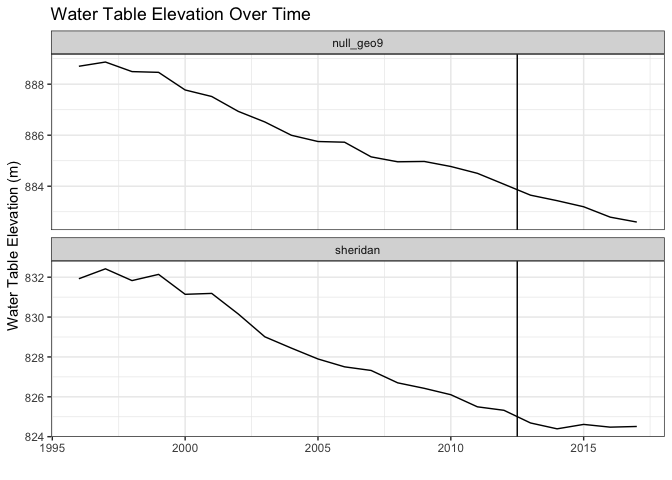
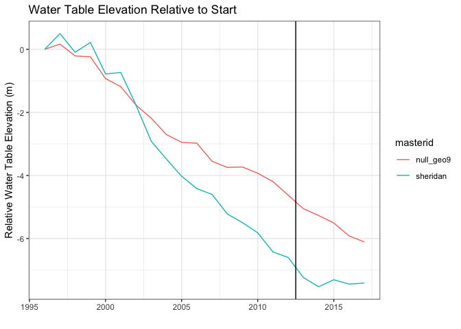
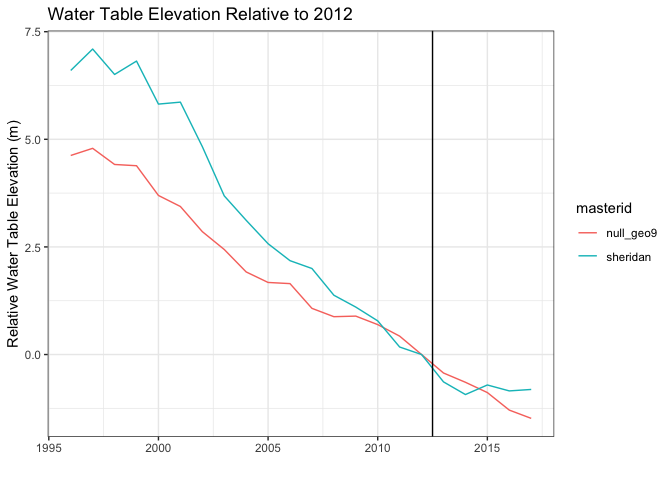
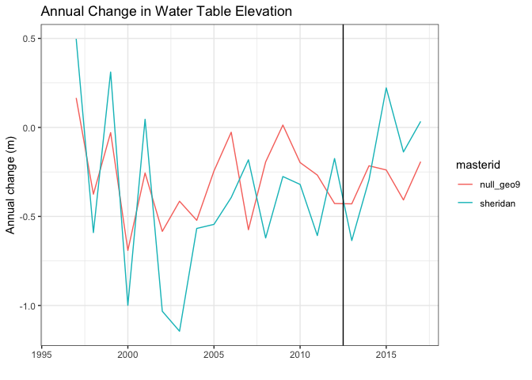

Goal: Analyse water level changes over time between the LEMA and Null study areas


**R Packages Needed**


```r
library(raster)
library(tidyverse)
library(rgdal)
library(lubridate)

# filepath to repo on local system
mainDir <- '/Users/deinesji/Documents/code_git/1phd/DeinesEtAl2019_ERL_lema1'
```

# Extract Mean Water Levels
Get mean water level from the kriged water levels (00.25_wells_wizard_actualKRIGING.Rmd) for each year, by region


```r
gisDir <- paste0(mainDir, '/data/GIS')
tabDirOut <- paste0(mainDir, '/data/tabular')
outFileName <- 'waterLevels_1996-2017_wizardKriged_lemaNull9_jimRemoved.csv'
startYear <- 1996

# load bounds
aoisBuff <- readOGR(paste0(gisDir,'/boundaries'),
                    'Combined_Null9_S6_10kmBuff_indvlPolys', verbose = FALSE)
aois.ll <- aoisBuff[aoisBuff$masterid != 'buffer',]

# load water levels
wlFiles <- list.files(paste0(gisDir,'/waterLevels'), 
                      pattern = '*waterTableElev_wizardKrige_m_jimRemoved',
                      full.names=TRUE)
wtElev <- stack(wlFiles)
names(wtElev) <- paste0('X',startYear:2017)

# get mean water levels by region ----------------------------------------
aois <- spTransform(aois.ll, CRS(proj4string(wtElev)))
wtables.mat <- raster::extract(wtElev, aois, fun = mean)
wtables <- as.data.frame(wtables.mat)
wtables$masterid <- c('sheridan','null_geo9')

# reshape data
wtablesLong <- gather(wtables, key = yearString, value = wtElev_m, 
                      paste0('X', startYear):X2017)
wtablesLong$year <- as.numeric(substr(wtablesLong$yearString, start = 2,stop=5))

# format and calculate water level from baseline, annual change
wtablesOut <- wtablesLong %>%
  mutate(Year = year(ymd(sprintf('%d-01-01',year)))) %>%
  dplyr::select(c(masterid, Year, wtElev_m)) %>%
  arrange(masterid,Year) %>%
  group_by(masterid) %>%
  mutate(wtRelative0_m = wtElev_m - wtElev_m[Year==min(Year)]) %>%
  mutate(wtRelative2012_m = wtElev_m - wtElev_m[Year==2012]) %>%
  mutate(annualChange_m = wtElev_m - lag(wtElev_m,1))

# # convince myself this is the same as getting the annual change raster, then 
# # taking the mean
# test <- wtElev[['X2001']] - wtElev[['X2000']]
# test1 <- raster::extract(test, aois, fun = mean)
# test1  # yep, the same

# cant wait plot
ggplot(wtablesOut,
       aes(x=Year, y = wtElev_m)) +
  geom_line() +
  facet_wrap(~masterid, scale = 'free_y', nrow=2) +
  geom_vline(xintercept = 2012.5) +
  theme_bw() + xlab('') + ylab('Water Table Elevation (m)') +
  ggtitle('Water Table Elevation Over Time')
```

<!-- -->

```r
# with a 0 baseline
ggplot(wtablesOut,
       aes(x=Year, y = wtRelative0_m, group = masterid, color=masterid)) +
  geom_line() +
  geom_vline(xintercept = 2012.5) +
  theme_bw() + 
  ylab('Relative Water Table Elevation (m)') + xlab('') +
  ggtitle('Water Table Elevation Relative to Start') 
```

<!-- -->

```r
# with a 2012 baseline
ggplot(wtablesOut,
       aes(x=Year, y = wtRelative2012_m, group = masterid,
           color=masterid)) +
  geom_line() +
  geom_vline(xintercept = 2012.5) +
  theme_bw() +   ylab('Relative Water Table Elevation (m)') + xlab('') +     
  ggtitle('Water Table Elevation Relative to 2012')
```

<!-- -->

```r
# annual change
ggplot(wtablesOut,
       aes(x=Year, y = annualChange_m, group = masterid,
           color=masterid)) +
  geom_line() +
  geom_vline(xintercept = 2012.5) +
  theme_bw() + ylab('Annual change (m)') + xlab('') +
  ggtitle('Annual Change in Water Table Elevation')
```

```
## Warning: Removed 2 rows containing missing values (geom_path).
```

<!-- -->

```r
write_csv(wtablesOut, paste0(tabDirOut,'/',outFileName))
```


