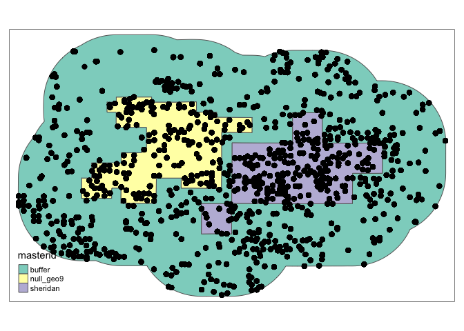

Goal: Subset WIMAS to study area and do some formatting.

update 10-18-2018: re-running with wimas data through 2017; and filtering by source. 


**R Packages Needed**


```r
library(tidyverse) # for ggplot2, tidyr, dplyr
library(sf)
library(lubridate)
library(tmap)

sessionInfo()
```

```
## R version 3.5.1 (2018-07-02)
## Platform: x86_64-apple-darwin15.6.0 (64-bit)
## Running under: macOS  10.14
## 
## Matrix products: default
## BLAS: /Library/Frameworks/R.framework/Versions/3.5/Resources/lib/libRblas.0.dylib
## LAPACK: /Library/Frameworks/R.framework/Versions/3.5/Resources/lib/libRlapack.dylib
## 
## locale:
## [1] en_US.UTF-8/en_US.UTF-8/en_US.UTF-8/C/en_US.UTF-8/en_US.UTF-8
## 
## attached base packages:
## [1] stats     graphics  grDevices utils     datasets  methods   base     
## 
## other attached packages:
##  [1] tmap_2.2        lubridate_1.7.4 sf_0.6-3        forcats_0.3.0  
##  [5] stringr_1.3.1   dplyr_0.7.6     purrr_0.2.5     readr_1.1.1    
##  [9] tidyr_0.8.1     tibble_1.4.2    ggplot2_3.1.0   tidyverse_1.2.1
## [13] knitr_1.20     
## 
## loaded via a namespace (and not attached):
##  [1] httr_1.3.1         jsonlite_1.5       viridisLite_0.3.0 
##  [4] modelr_0.1.2       shiny_1.1.0        assertthat_0.2.0  
##  [7] stats4_3.5.1       sp_1.3-1           cellranger_1.1.0  
## [10] yaml_2.2.0         pillar_1.3.0       backports_1.1.2   
## [13] lattice_0.20-35    glue_1.3.0         digest_0.6.16     
## [16] RColorBrewer_1.1-2 promises_1.0.1     rvest_0.3.2       
## [19] colorspace_1.3-2   htmltools_0.3.6    httpuv_1.4.5      
## [22] plyr_1.8.4         XML_3.98-1.16      pkgconfig_2.0.2   
## [25] broom_0.5.0        raster_2.6-7       haven_1.1.2       
## [28] xtable_1.8-3       webshot_0.5.1      scales_1.0.0      
## [31] satellite_1.0.1    later_0.7.3        withr_2.1.2       
## [34] lazyeval_0.2.1     cli_1.0.0          mapview_2.6.0     
## [37] magrittr_1.5       crayon_1.3.4       readxl_1.1.0      
## [40] mime_0.5           evaluate_0.11      nlme_3.1-137      
## [43] xml2_1.2.0         lwgeom_0.1-4       class_7.3-14      
## [46] tools_3.5.1        hms_0.4.2          munsell_0.5.0     
## [49] bindrcpp_0.2.2     compiler_3.5.1     e1071_1.7-0       
## [52] rlang_0.2.2        classInt_0.2-3     units_0.6-1       
## [55] grid_3.5.1         tmaptools_2.0-1    dichromat_2.0-0   
## [58] rstudioapi_0.7     htmlwidgets_1.3    crosstalk_1.0.0   
## [61] base64enc_0.1-3    rmarkdown_1.10     gtable_0.2.0      
## [64] DBI_1.0.0          R6_2.2.2           rgdal_1.3-4       
## [67] rgeos_0.3-28       bindr_0.1.1        rprojroot_1.3-2   
## [70] KernSmooth_2.23-15 stringi_1.2.4      Rcpp_0.12.19      
## [73] png_0.1-7          leaflet_2.0.2      spData_0.2.9.3    
## [76] tidyselect_0.2.4
```

# Load Data
Formatted WIMAS data (Anthony + Jill pre-cleaning) and AOI shapefile produced in 03.01_wells_WIZARD. Formatted data produced by:

* downloaded the full WIMAS database from http://hercules.kgs.ku.edu/geohydro/wimas/query_setup.cfm, annually
* formatting with 00.30_wells_WIMAS_preprocessing.py (Anthony Kendall)
* reshaping with 00.33_wells_WIMAS_preprocessing2.Rmd (Jill Deines)

## Subset WIMAS Data
Subset WIMAS for study area only to create a smaller file to be used in subsequent analyses. Run once.

Also exports lists of wells in study regions


```r
# directories
projFolder <- '/Users/deinesji/Documents/code_git/1phd/DeinesEtAl2019_ERL_lema1'
gisDir <- paste0(projFolder, '/data/GIS/boundaries')
wellDir <- paste0(projFolder, '/data/wellData/WIMAS_AnthonyCleaned_JillFormatted')
proj <- 4267 
startYear <- 1996
endYear <- 2017

# well data (orriginally in 4267, NAD27)
wimas0 <- read_csv(paste0(wellDir, '/WIMAS_1990-2017_gwPts_ksHpa_withSource.csv')) %>%
  st_as_sf(coords = c('LONGITUDE','LATITUDE'), crs = proj)
#st_write(wimas0, paste0(wellDir, '/WIMAS_1990-2017_gwPts_ksHpa_withSource.shp'))
wimas <- wimas0 %>% filter(source == 'GW')

# boundaries of interest (orriginally in 4269, NAD83)
AOIs <- read_sf(paste0(gisDir,'/Combined_Null9_S6_10kmBuff_indvlPolys.shp')) %>%
  st_transform(proj)

# extract points in both aois
wellsIn <- st_join(wimas, AOIs) %>% filter(!is.na(masterid))

# keep data from startYear on
wellsInTime <- wellsIn %>%
  filter(year >= startYear)

# unique wells by region?
wellsInTime %>% 
  group_by(masterid) %>%
  summarize(n = n_distinct(PDIV_ID))

# export culled data as shapefile, csv, 
write_sf(wellsInTime, paste0(wellDir,'/WIMAS_', startYear,'-', endYear, '_Lema1Buffer.shp'))
write_sf(wellsInTime, paste0(wellDir,'/WIMAS_', startYear,'-', endYear, '_Lema1Buffer.csv'))

# and list of well IDs

# get unique pdiv_ids: full buffer
wellIds <- data.frame(PDIV_ID = unique(wellsInTime$PDIV_ID))
write.csv(wellIds, 
          paste0(wellDir,'/wellList/wimas_wellIDs_buffer_',startYear,'_on_', endYear,'.csv'), 
          row.names=FALSE)

# get unique pdiv_ids: lema and null9
wellsInTime.df <- wellsInTime
st_geometry(wellsInTime.df) <- NULL
regionWellIds <- wellsInTime.df %>%
  filter(masterid %in% c('null_geo9','sheridan')) %>%
  distinct(PDIV_ID)
write.csv(regionWellIds, paste0(wellDir,'/wellList/wimas_wellIDs_lemaNull_',
                              startYear, '_',endYear,'.csv'), 
          row.names=FALSE)
```

## Format a bit more
Make a file with just Sheridan and the Null9 region; will further tabulate in the 05.10_makeMasterDataFile.Rmd

Also convert units, add crop key


```r
# directories
gisDir <- '/Users/deinesji/Dropbox/1PhdJill/hpa/LEMA_Part1/data/GIS/boundaries'
wellDir <- '/Users/deinesji/Dropbox/1PhdJill/hpa/LEMA_Part1/data/wellData/WIMAS_AnthonyCleaned_JillFormatted'
proj <- 4267 
startYear <- 1996
endYear <- 2017

# well data (orriginally in 4267, NAD27)
wimas <- read_sf(paste0(wellDir, '/WIMAS_1996-2017_Lema1Buffer.shp'))

# boundaries of interest (orriginally in 4269, NAD83)
AOIs <- read_sf(paste0(gisDir,'/Combined_Null9_S6_10kmBuff_indvlPolys.shp')) %>%
  st_transform(proj)

# plot for funzies
tm_shape(AOIs) + tm_polygons('masterid') + tm_shape(wimas) + tm_dots(size=.3)
```

<!-- -->

```r
# remove buffer wells
wimas2 <- wimas %>% filter(masterid != 'buffer')

# convert units
wimas3 <- wimas2 %>% 
  mutate(area_m2 = acres * 4046.86,
         depth_m = depth * 0.3048,
         volume_m3 = volume * 1233.48) %>%
  select(c(masterid, year, PDIV_ID, crop, volume_m3, area_m2, depth_m, system))

# # # export this for future use
# write_sf(wimas3, paste0(wellDir,'/WIMAS_', startYear,
#                         '-',endYear,'_SheridanNull9_convertedUnits.shp'))
# write_sf(wimas3, paste0(wellDir,'/WIMAS_', startYear,
#                         '-',endYear,'_SheridanNull9_convertedUnits.csv'))
```

## Count wells by region


```r
yearCounts <- wimas3 %>%
  as.data.frame() %>%
  group_by(masterid, year) %>%
  summarize(wells = n())

kable(yearCounts)
```


masterid     year   wells
----------  -----  ------
null_geo9    1996     154
null_geo9    1997     154
null_geo9    1998     155
null_geo9    1999     155
null_geo9    2000     155
null_geo9    2001     155
null_geo9    2002     155
null_geo9    2003     156
null_geo9    2004     156
null_geo9    2005     157
null_geo9    2006     157
null_geo9    2007     157
null_geo9    2008     157
null_geo9    2009     157
null_geo9    2010     157
null_geo9    2011     157
null_geo9    2012     159
null_geo9    2013     159
null_geo9    2014     159
null_geo9    2015     159
null_geo9    2016     156
null_geo9    2017     156
sheridan     1996     188
sheridan     1997     188
sheridan     1998     188
sheridan     1999     188
sheridan     2000     188
sheridan     2001     188
sheridan     2002     188
sheridan     2003     188
sheridan     2004     188
sheridan     2005     188
sheridan     2006     188
sheridan     2007     188
sheridan     2008     188
sheridan     2009     188
sheridan     2010     188
sheridan     2011     186
sheridan     2012     185
sheridan     2013     185
sheridan     2014     185
sheridan     2015     185
sheridan     2016     185
sheridan     2017     185

### count wells with data
more specifically, count wells that have data at least 1x in study period


```r
# filter out wells without data during study period
wellsWithData <- wimas3 %>%
  ungroup() %>%
  group_by(PDIV_ID) %>%
  # count years of NA's
  summarise(missingYears = sum(is.na(volume_m3))) 

# check out missing year counts
table(wellsWithData$missingYears)
```

```
## 
##   0 
## 365
```

```r
# get list of wells with no data in all 21 years from 1996-2017
wellsWithData2 <- wellsWithData %>%  filter(missingYears < 21)


yearCounts2 <- wimas3 %>%
  as.data.frame() %>%
  # remove wells without data during 1996-2017
  filter(PDIV_ID %in% wellsWithData2$PDIV_ID) %>%
  group_by(masterid, year) %>%
  summarize(wells = n())

kable(yearCounts2)
```


masterid     year   wells
----------  -----  ------
null_geo9    1996     154
null_geo9    1997     154
null_geo9    1998     155
null_geo9    1999     155
null_geo9    2000     155
null_geo9    2001     155
null_geo9    2002     155
null_geo9    2003     156
null_geo9    2004     156
null_geo9    2005     157
null_geo9    2006     157
null_geo9    2007     157
null_geo9    2008     157
null_geo9    2009     157
null_geo9    2010     157
null_geo9    2011     157
null_geo9    2012     159
null_geo9    2013     159
null_geo9    2014     159
null_geo9    2015     159
null_geo9    2016     156
null_geo9    2017     156
sheridan     1996     188
sheridan     1997     188
sheridan     1998     188
sheridan     1999     188
sheridan     2000     188
sheridan     2001     188
sheridan     2002     188
sheridan     2003     188
sheridan     2004     188
sheridan     2005     188
sheridan     2006     188
sheridan     2007     188
sheridan     2008     188
sheridan     2009     188
sheridan     2010     188
sheridan     2011     186
sheridan     2012     185
sheridan     2013     185
sheridan     2014     185
sheridan     2015     185
sheridan     2016     185
sheridan     2017     185

