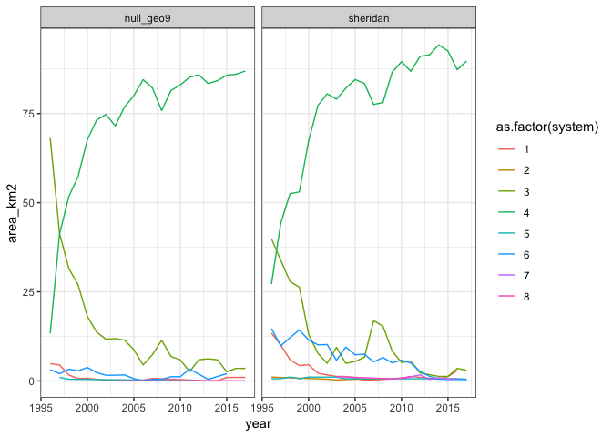
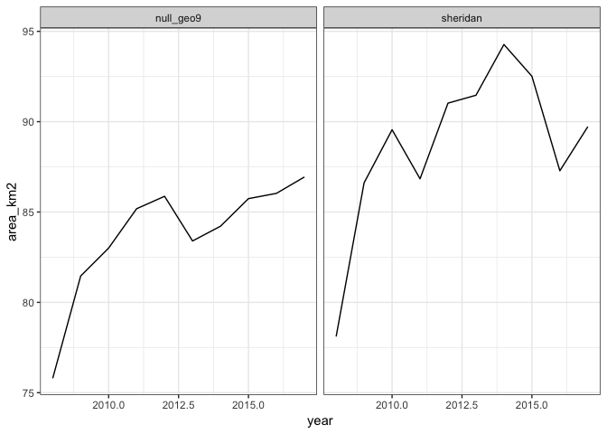

Goal: Combine data sets into a master file for analysis

Update 10/18/2018: re-done with WIMAS data including 2017


**R Packages Needed**


```r
library(tidyverse)

# filepath to repo on local system
mainDir <- '/Users/deinesji/Documents/code_git/1phd/DeinesEtAl2019_ERL_lema1'

sessionInfo()
```

```
## R version 3.5.1 (2018-07-02)
## Platform: x86_64-apple-darwin15.6.0 (64-bit)
## Running under: macOS  10.14
## 
## Matrix products: default
## BLAS: /Library/Frameworks/R.framework/Versions/3.5/Resources/lib/libRblas.0.dylib
## LAPACK: /Library/Frameworks/R.framework/Versions/3.5/Resources/lib/libRlapack.dylib
## 
## locale:
## [1] en_US.UTF-8/en_US.UTF-8/en_US.UTF-8/C/en_US.UTF-8/en_US.UTF-8
## 
## attached base packages:
## [1] stats     graphics  grDevices utils     datasets  methods   base     
## 
## other attached packages:
## [1] forcats_0.3.0   stringr_1.3.1   dplyr_0.7.6     purrr_0.2.5    
## [5] readr_1.1.1     tidyr_0.8.1     tibble_1.4.2    ggplot2_3.1.0  
## [9] tidyverse_1.2.1
## 
## loaded via a namespace (and not attached):
##  [1] Rcpp_0.12.19     cellranger_1.1.0 pillar_1.3.0     compiler_3.5.1  
##  [5] plyr_1.8.4       bindr_0.1.1      tools_3.5.1      digest_0.6.16   
##  [9] lubridate_1.7.4  jsonlite_1.5     evaluate_0.11    nlme_3.1-137    
## [13] gtable_0.2.0     lattice_0.20-35  pkgconfig_2.0.2  rlang_0.2.2     
## [17] cli_1.0.0        rstudioapi_0.7   yaml_2.2.0       haven_1.1.2     
## [21] bindrcpp_0.2.2   withr_2.1.2      xml2_1.2.0       httr_1.3.1      
## [25] knitr_1.20       hms_0.4.2        rprojroot_1.3-2  grid_3.5.1      
## [29] tidyselect_0.2.4 glue_1.3.0       R6_2.2.2         readxl_1.1.0    
## [33] rmarkdown_1.10   modelr_0.1.2     magrittr_1.5     backports_1.1.2 
## [37] scales_1.0.0     htmltools_0.3.6  rvest_0.3.2      assertthat_0.2.0
## [41] colorspace_1.3-2 stringi_1.2.4    lazyeval_0.2.1   munsell_0.5.0   
## [45] broom_0.5.0      crayon_1.3.4
```

# Get to It

## CDL
area by CDL type and irrigation status (aim-rrb) was exported using GEE script 00.04_gee_CDL_Summaries_final.js

### Load and format

2015 and 2015 have extra cdl class columns: 251,252,253. In all national
metadata files for 2008 - 2016, these values are all NA. So, dropping columns.
most come with a 0 column which is nonsense, so removing so all match.
2013 has a class 62 that is NA for all others, for 'pasture/grass', but no
classified cells for this class, so removing that as well.


```r
# directories
dataDir <- paste0(mainDir, '/data/tabular')
# cdl key 
cdlkey <- read.csv(paste0(dataDir, '/CDL_key_2014.csv'))

# CDL  annual files -  read in to a single dataframe
cdlfiles <- list.files(paste0(dataDir,'/cdl_tables_lema'),
            pattern="*Sheridan_Null9_area_irrigationStatus_tractsOnly_giFixed",
                       full.names = TRUE)

# read in to a single dataframe, removing junk columns and first dummy row
dataAll <- as.data.frame(do.call(rbind, lapply(cdlfiles, function(x) {
  csv1 <- read.csv(x)
  csv1 <- csv1[, -which(names(csv1)%in% c('system.index','.geo','X0','X62',
                                          'X251','X252','X253'))]
  csv1 <- csv1[-1,]    # remove dummy row
  csv2 <- csv1[csv1$masterid %in% c('sheridan','null_geo9'),]
})))  

# convert to long data format and remove NA's
dataLong <- gather(dataAll, key = cdlCode, value = area_m2, X1:X92)
dataLong <- dataLong[!is.na(dataLong$area_m2),]

# add a crop type column using cdl key
dataLong$cdlCode <- as.numeric(substr(dataLong$cdlCode, start = 2, 
                                      stop = nchar(dataLong$cdlCode)))
cdlkey$cdlClassName <- as.character(cdlkey$CLASS_NAME)
dataLong2 <- merge(dataLong, cdlkey[,c('VALUE','cdlClassName')],
                   by.x = 'cdlCode', by.y = 'VALUE')

# reogranize
cdlLong <- dataLong2 %>%
  select(c(masterid, Year, status, cdlCode, cdlClassName, area_m2))
```

### Derive CDL totals
Factors of interest:

* annual active cropland
* annual fallow
* annual irrigated
* annual rainfed
* irrigated/nonirrigated corn
* irrigted/nonirrigated sorghum
* irrigated/nonirrigated soy
* irrigated/nonirrigated wheat
* irrigated/nonirrigated alfalfa


```r
# included switchgrass (60) in non-ag, grass pasture (176)
nonAg <- c(0,60,63,64,65, 81, 82, 83, 87, 88, 92, 111, 112, 121,122,123,124,131,
           141, 142, 143, 152, 176, 190, 195)

fallow <- 61
doubleCrop <- c(225,226, 230:241, 254)

top5 <- c(1,4,5,24,36) # corn, sorghum, soy, wheat, alfalfa

# summarize categories (this feels inefficient but im uninspired)
nonAgTotal <- cdlLong %>%
  group_by(masterid, Year) %>%
  filter(cdlCode %in% nonAg) %>%
  summarize(nonAg_ha = sum(area_m2*1e-4))

fallowtotal <- cdlLong %>%
  group_by(masterid, Year) %>%
  filter(cdlCode %in% fallow) %>%
  summarize(fallow_ha = sum(area_m2*1e-4))

doubleCropTotal <- cdlLong %>%
  group_by(masterid, Year) %>%
  filter(cdlCode %in% doubleCrop) %>%
  summarize(doubleCropped_ha = sum(area_m2*1e-4))

activeAg <- cdlLong %>%
  group_by(masterid, Year) %>%
  filter(!(cdlCode %in% c(nonAg,fallow))) %>%
  summarize(cropActive_ha = sum(area_m2*1e-4))

# get ag by irrigated status and start for format for combining
agByStatus <- cdlLong %>%
  filter(!(cdlCode %in% c(nonAg,fallow))) %>%
  group_by(masterid, Year, status) %>%
  summarize(area_ha = sum(area_m2*1e-4)) %>%
  spread(., key = status, value = area_ha) %>%
  rename(irrigated_ha = irrigated, rainfed_ha = rainfed)

# get top 5 crops by irrigated status and start for format for combining
top5IrrStatus <- cdlLong %>%
  filter(cdlCode %in% top5) %>%
  group_by(masterid, Year, status, cdlClassName) %>%
  summarize(cropArea_ha = sum(area_m2*1e-4)) %>%
  mutate(crop_status = 
           gsub(" ", "", paste(cdlClassName,status,'ha',sep = '_'))) %>%
  ungroup() %>%
  select(-c(status, cdlClassName)) %>%
  spread(., key = crop_status, value = cropArea_ha)

# add 'em together: wide format
cdlVars <- cdlLong %>%
  group_by(masterid, Year) %>%
  summarize(totalArea_ha = sum(area_m2*1e-4)) %>%
  left_join(activeAg, by = c('masterid','Year')) %>%
  left_join(fallowtotal, by = c('masterid','Year')) %>%
  left_join(doubleCropTotal, by = c('masterid','Year')) %>%
  left_join(nonAgTotal, by = c('masterid','Year')) %>%
  left_join(agByStatus, by = c('masterid','Year')) %>%
  left_join(top5IrrStatus, by = c('masterid','Year'))

# question: how much of irrigated area is represented by top 4 crops?
means <- cdlVars %>%
  ungroup() %>%
  filter(Year >= 2008) %>%
  group_by(masterid) %>%
  summarize(meanActiveCrop = mean(cropActive_ha),
            meanIrrCrop = mean(irrigated_ha),
            meanCornirr = mean(Corn_irrigated_ha),
            meanSorgIrr = mean(Sorghum_irrigated_ha),
            meanWheatIrr = mean(WinterWheat_irrigated_ha),
            meanSoyIrr = mean(Soybeans_irrigated_ha),
            meanAlfIrr = mean(Alfalfa_irrigated_ha))

means %>%
  rowwise() %>%
  mutate(main4Area = sum(meanCornirr, meanSorgIrr, meanWheatIrr, meanSoyIrr),
         percentOfIrr = main4Area/meanIrrCrop*100)
```

```
## Source: local data frame [2 x 10]
## Groups: <by row>
## 
## # A tibble: 2 x 10
##   masterid meanActiveCrop meanIrrCrop meanCornirr meanSorgIrr meanWheatIrr
##   <fct>             <dbl>       <dbl>       <dbl>       <dbl>        <dbl>
## 1 null_ge…         18083.       7800.       6498.        196.         324.
## 2 sheridan         18347.       8826.       6449.        562.         395.
## # ... with 4 more variables: meanSoyIrr <dbl>, meanAlfIrr <dbl>,
## #   main4Area <dbl>, percentOfIrr <dbl>
```

```r
# alfalfa percent of irrigated area
means$meanAlfIrr/means$meanIrrCrop
```

```
## [1] 0.0128273 0.0139630
```

## Other Data
Add water levels, ancillary variables like precip and aridity, commodity prices(?) aim_rrb

### AIM derived climate and area
Summaries of irrigated area from AIM-RRB and associated ancillary variables extracted in GEE script 00.07_gee_Get_AIMRRB_andAncillary_Final.js; the ancillary variables sampled  here are from the script 00.06_gee_makeAncillaryData, which was used to generate climate summaries for the full High Plains Aquifer + additional regions for a related project. 


```r
#   annual files -  read in to a single dataframe
aimFiles <- list.files(paste0(dataDir,'/aimrrb_plusAncillary_lema'),
                       pattern="*TractMaskedGiFixed")

# read in to a single dataframe, removing junk columns and first dummy row
aimAll <- as.data.frame(do.call(rbind, lapply(aimFiles, function(x) {
  csv1 <- read_csv(paste0(dataDir,'/aimrrb_plusAncillary_lema/',x))
  # remove junk and "non irrigated" column (since cdlVar has non-irr cropland)
  csv2 <- csv1[, -which(names(csv1)%in% c('system:index','.geo', 'groups', '0'))]
  # don't include data for buffer zone
  csv3 <- csv2[csv2$masterid %in% c('sheridan','null_geo9'),]
  # files prior to 1999 (aim-rrb start year) are missing a `1` irrigated column
  if(!(1 %in% names(csv3))) {
    csv3$`1` <- NA
  }
  # rename irrigated
  csv3$aimIrr_ha <- csv3$`1` *1e-4
  # add a year column based on file name
  csv3$Year <- as.numeric(substr(x, start=1,stop=4))
  # arrange output
  csv4 <- csv3 %>%
    select(c(masterid, Year, aimIrr_ha, pr_calendar, pr_ann, pr_grow, aridity))
})))  

# combine with cdlVars
oneData00 <- aimAll %>%
  left_join(cdlVars, by = c('masterid','Year'))
```

```
## Warning: Column `masterid` joining character vector and factor, coercing
## into character vector
```

### Commodity Prices
2017 inflation Adjusted corn prices (as a proxy for all commodity prices, due to high correlation) derived from NASS stats in 00.10_getCornPrices.Rmd


```r
# load and format
prices <- read_csv(paste0(dataDir,'/commodityPrices/NASS_corn_prices_1996-2017_inflationAdjusted_2017dollars.csv')) %>%
  mutate(cornPriceAdj2017 = Value) %>%
  select(c(Year,cornPriceAdj2017))
```

```
## Parsed with column specification:
## cols(
##   Year = col_integer(),
##   Commodity = col_character(),
##   Value = col_double(),
##   unit = col_character(),
##   adj_factor_2017 = col_double(),
##   price_2017 = col_double()
## )
```

```r
# combine (should fill in rows for sheridan and null)
oneData0 <- oneData00 %>%
  left_join(prices, by = 'Year')
```


### Water Levels
Processed, kriged, and summarized in scripts 00.2X_wells_wizardXXXXX.Rmd.


```r
# load water levels
waterLevels <- read_csv(paste0(dataDir,'/waterLevels_1996-2017_wizardKriged_lemaNull9_jimRemoved.csv'))
```

```
## Parsed with column specification:
## cols(
##   masterid = col_character(),
##   Year = col_double(),
##   wtElev_m = col_double(),
##   wtRelative0_m = col_double(),
##   wtRelative2012_m = col_double(),
##   annualChange_m = col_double()
## )
```

```r
# add to massive data frame
oneData000 <- waterLevels %>%
  left_join(oneData0, by = c('masterid','Year')) %>%
  rename(pr_calendar_mm = pr_calendar,
         pr_JanAug_mm = pr_ann,
         pr_grow_mm = pr_grow)
```

### WIMAS and Pumping
Processed and cleaned in scripts 00.3X_wells_WIMAS_XXXX.Rmd

Get summed volume and area by region. Note raw data is not provided but can be obtained at the link provided in 00.30_wells_WIMAS_preprocessing.Rmd


```r
wellDir <- paste0(mainDir, '/data/wellData/WIMAS_AnthonyCleaned_JillFormatted')

# load and sum
wimas <- read_csv(paste0(wellDir,
                         '/WIMAS_1996-2017_SheridanNull9_convertedUnits.csv')) %>%
  rename(Year = year) %>%
  group_by(masterid, Year) %>%
  summarize(wimasVol_km3 = sum(volume_m3 * 1e-6, na.rm = TRUE),
            wimasIrrArea_ha = sum(area_m2 * 1e-4, na.rm=TRUE))
```

```
## Parsed with column specification:
## cols(
##   masterid = col_character(),
##   year = col_integer(),
##   PDIV_ID = col_integer(),
##   crop = col_integer(),
##   volume_m3 = col_double(),
##   area_m2 = col_double(),
##   depth_m = col_double(),
##   system = col_integer()
## )
```

```r
# combine
oneData <-  wimas %>%
  right_join(oneData000, by = c('masterid','Year')) %>%
  arrange(Year, masterid)

oneData
```

```
## # A tibble: 44 x 31
## # Groups:   masterid [2]
##    masterid  Year wimasVol_km3 wimasIrrArea_ha wtElev_m wtRelative0_m
##    <chr>    <dbl>        <dbl>           <dbl>    <dbl>         <dbl>
##  1 null_ge…  1996         29.6           9035.     889.        0     
##  2 sheridan  1996         31.8           9688.     832.        0     
##  3 null_ge…  1997         30.7           9096.     889.        0.166 
##  4 sheridan  1997         30.2           9861.     832.        0.498 
##  5 null_ge…  1998         30.6           8996.     888.       -0.209 
##  6 sheridan  1998         29.4           9961.     832.       -0.0929
##  7 null_ge…  1999         24.7           8920.     888.       -0.238 
##  8 sheridan  1999         26.3           9945.     832.        0.218 
##  9 null_ge…  2000         42.0           9227.     888.       -0.929 
## 10 sheridan  2000         40.8           9799.     831.       -0.781 
## # ... with 34 more rows, and 25 more variables: wtRelative2012_m <dbl>,
## #   annualChange_m <dbl>, aimIrr_ha <dbl>, pr_calendar_mm <dbl>,
## #   pr_JanAug_mm <dbl>, pr_grow_mm <dbl>, aridity <dbl>,
## #   totalArea_ha <dbl>, cropActive_ha <dbl>, fallow_ha <dbl>,
## #   doubleCropped_ha <dbl>, nonAg_ha <dbl>, irrigated_ha <dbl>,
## #   rainfed_ha <dbl>, Alfalfa_irrigated_ha <dbl>,
## #   Alfalfa_rainfed_ha <dbl>, Corn_irrigated_ha <dbl>,
## #   Corn_rainfed_ha <dbl>, Sorghum_irrigated_ha <dbl>,
## #   Sorghum_rainfed_ha <dbl>, Soybeans_irrigated_ha <dbl>,
## #   Soybeans_rainfed_ha <dbl>, WinterWheat_irrigated_ha <dbl>,
## #   WinterWheat_rainfed_ha <dbl>, cornPriceAdj2017 <dbl>
```

```r
names(oneData)
```

```
##  [1] "masterid"                 "Year"                    
##  [3] "wimasVol_km3"             "wimasIrrArea_ha"         
##  [5] "wtElev_m"                 "wtRelative0_m"           
##  [7] "wtRelative2012_m"         "annualChange_m"          
##  [9] "aimIrr_ha"                "pr_calendar_mm"          
## [11] "pr_JanAug_mm"             "pr_grow_mm"              
## [13] "aridity"                  "totalArea_ha"            
## [15] "cropActive_ha"            "fallow_ha"               
## [17] "doubleCropped_ha"         "nonAg_ha"                
## [19] "irrigated_ha"             "rainfed_ha"              
## [21] "Alfalfa_irrigated_ha"     "Alfalfa_rainfed_ha"      
## [23] "Corn_irrigated_ha"        "Corn_rainfed_ha"         
## [25] "Sorghum_irrigated_ha"     "Sorghum_rainfed_ha"      
## [27] "Soybeans_irrigated_ha"    "Soybeans_rainfed_ha"     
## [29] "WinterWheat_irrigated_ha" "WinterWheat_rainfed_ha"  
## [31] "cornPriceAdj2017"
```

Bonus: analysis changes in irrigation tech for reviewer


```r
wellDir <- paste0(mainDir, '/data/wellData/WIMAS_AnthonyCleaned_JillFormatted')

systemKey <- data.frame(system=1:9,
                        systemCode = c('flood','trickledrip','center pivot','center pivot lepa',
                                       'sprinkler other than cp','center pivot and flood',
                                       'subsurface drip in combo with other','other',
                                       'center pivot with mobile drip'))

# load 
wimas2 <- read_csv(paste0(wellDir,
                         '/WIMAS_1996-2017_SheridanNull9_convertedUnits.csv')) %>%
  left_join(systemKey) %>%
  #filter(year >= 2008) %>%
  filter(system != -99)
```

```
## Parsed with column specification:
## cols(
##   masterid = col_character(),
##   year = col_integer(),
##   PDIV_ID = col_integer(),
##   crop = col_integer(),
##   volume_m3 = col_double(),
##   area_m2 = col_double(),
##   depth_m = col_double(),
##   system = col_integer()
## )
```

```
## Joining, by = "system"
```

```r
# get area by system
systemArea <- wimas2 %>%
  group_by(masterid, year, system) %>%
  summarize(area_km2 = sum(area_m2)*1e-6) %>%
  filter(area_km2 >0) 

# plot
ggplot(systemArea,
       aes(x = year, y = area_km2, color = as.factor(system), group = as.factor(system))) +
  geom_line() +
  facet_wrap(~masterid) +
  theme_bw()
```

<!-- -->

```r
# compare percent increase in lepa
# add a column for presence of LEMA program
lemaKey <- data.frame(year = 1996:2017,
                      isLema = c(rep('before',17),rep('post',5)))
lepa <- systemArea %>%
  left_join(lemaKey) %>%
  filter(system ==4 & year >= 2008)
```

```
## Joining, by = "year"
```

```r
ggplot(lepa,
       aes(x = year, y = area_km2)) +
  geom_line() +
  facet_wrap(~masterid) +
  theme_bw()
```

<!-- -->

```r
nullLepa <- lm(area_km2~year, data = lepa[lepa$masterid == 'null_geo9',])
summary(nullLepa)
```

```
## 
## Call:
## lm(formula = area_km2 ~ year, data = lepa[lepa$masterid == "null_geo9", 
##     ])
## 
## Residuals:
##     Min      1Q  Median      3Q     Max 
## -4.1321 -0.7726 -0.4063  1.1978  2.6965 
## 
## Coefficients:
##               Estimate Std. Error t value Pr(>|t|)   
## (Intercept) -1630.9333   465.9331   -3.50  0.00807 **
## year            0.8520     0.2315    3.68  0.00622 **
## ---
## Signif. codes:  0 '***' 0.001 '**' 0.01 '*' 0.05 '.' 0.1 ' ' 1
## 
## Residual standard error: 2.103 on 8 degrees of freedom
## Multiple R-squared:  0.6287,	Adjusted R-squared:  0.5822 
## F-statistic: 13.54 on 1 and 8 DF,  p-value: 0.006218
```

```r
sd6Lepa <- lm(area_km2~year, data = lepa[lepa$masterid == 'sheridan',])
summary(sd6Lepa)
```

```
## 
## Call:
## lm(formula = area_km2 ~ year, data = lepa[lepa$masterid == "sheridan", 
##     ])
## 
## Residuals:
##    Min     1Q Median     3Q    Max 
## -6.630 -2.406  1.272  2.618  4.198 
## 
## Coefficients:
##               Estimate Std. Error t value Pr(>|t|)  
## (Intercept) -1700.8849   847.8911  -2.006   0.0798 .
## year            0.8893     0.4213   2.111   0.0678 .
## ---
## Signif. codes:  0 '***' 0.001 '**' 0.01 '*' 0.05 '.' 0.1 ' ' 1
## 
## Residual standard error: 3.827 on 8 degrees of freedom
## Multiple R-squared:  0.3577,	Adjusted R-squared:  0.2774 
## F-statistic: 4.455 on 1 and 8 DF,  p-value: 0.0678
```

## Export
This df will be used for subsequent analyses


```r
write_csv(oneData, paste0(dataDir, '/masterTidyData_Wide_aimTractMaskedGiFixed_jimRemoved_with2017_20181018.csv'))
```

